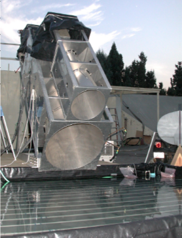
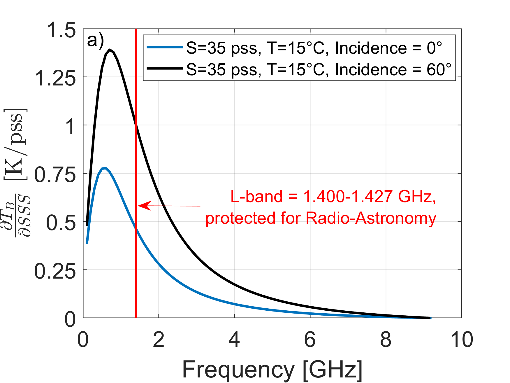
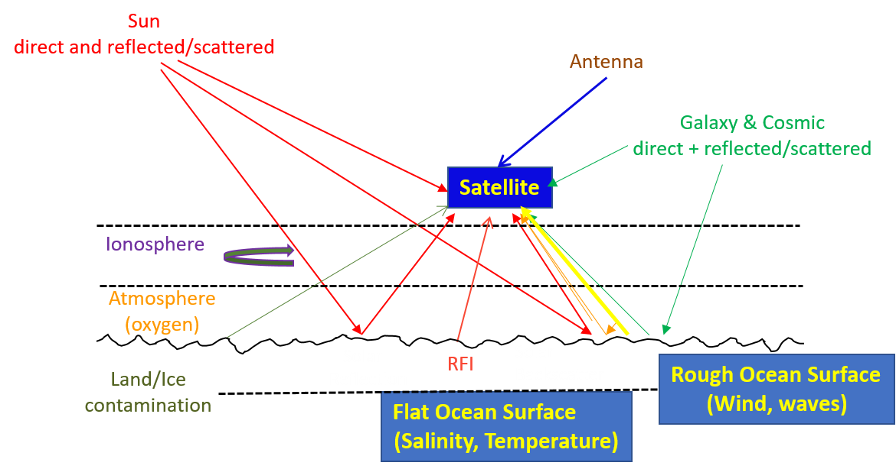
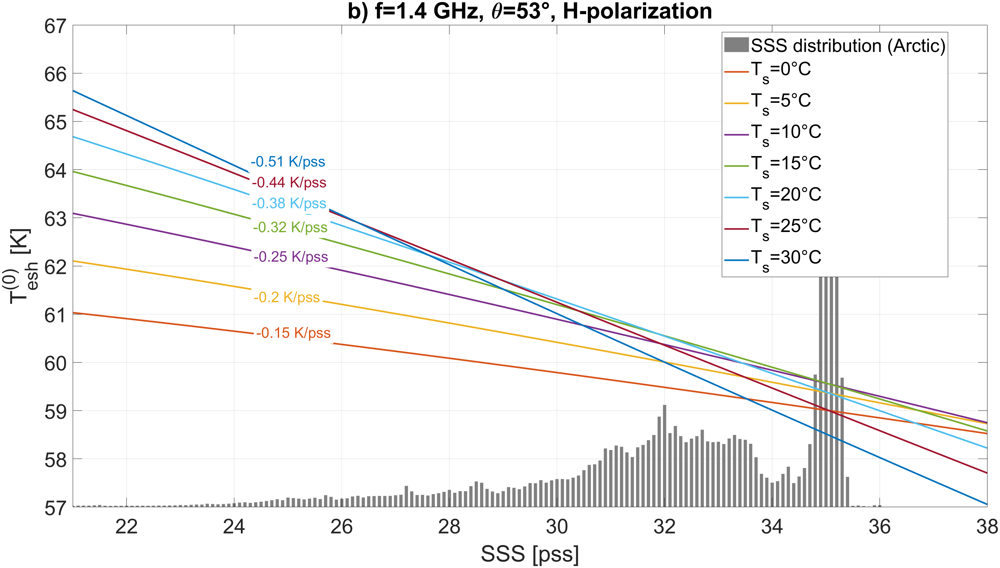
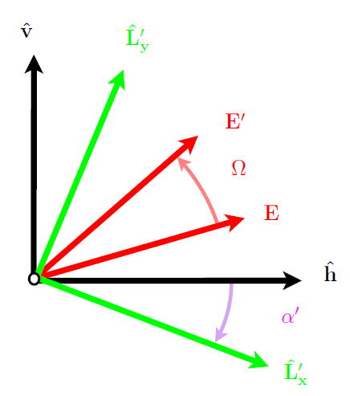
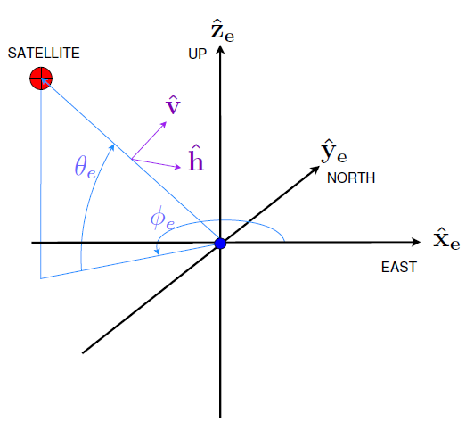

# Baseline Algorithm Definition


### Sea Surface Salinity retrieval over a perfectly flat sea surface 




```{figure} ../Flat_Sea_Rad.png
--- 
name: Flat_Sea_Rad
---
Radiometer measuring the brightness temperature emitted by a perfectly flat sea surface water body. 
```

The dependence of the microwave brigthness temperature emitted by the sea surface $T_{B}$ on SSS is contained in the emissivity, $e$: $T_{B} = T \times e$, where $\it{T}$ is the sea surface temperature. The emissivity $e$ is a quantity that depends on physical and chemical properties of the water (e.g. salinity and temperature), observational conditions (incidence angle, electromagnetic frequency, polarization), as well as on the sea surface roughness. 

For a perfectly flat ocean surface the scattered electric and magnetic fields may be expressed in terms of the incident fields. The reflected electric field components $(E_{h}^{'},E_{v}^{'})$  are related to the incident components $(E_{h},E_{v})$ by the diagonal matrix equation:

$$
\begin{pmatrix}
E_{h}^{'}(\theta_s,\phi_s) \\ 
E_{v}^{'}(\theta_s,\phi_s)
\end{pmatrix}=
\begin{pmatrix}
R_{hh}^{(0)} & 0 \\ 
0 & R_{vv}^{(0)}   
\end{pmatrix}
\begin{pmatrix}
E_{h}(\theta_s,\phi_s-180°) \\ 
E_{v}(\theta_s,\phi_s-180°)
\end{pmatrix}$$	

where $(\theta_s,\phi_s)$ is the specular reflection direction for radiation incident from direction $(\theta_s,\phi_s-180°$). The superscripts on the reflection coefficients indicate that they correpond to zero order expansion in surface slope, i.e., the flat surface reflection. The flat surface reflection coefficients on the preceeding matrix are given by the Fresnel equations:

$R_{vv}^{(0)} (\theta_s,f,S,T_s)=\displaystyle\frac{\sqrt{ε_{sw}(f,S,T_s)-\sin^2⁡{\theta_s}}-ε_{sw}(f,S,T_s) \cos\theta_s}{\sqrt{ε_{sw}(f,S,T_s)-\sin^2{\theta_s}}+ε_{sw}(f,S,T_s) \cos{\theta}}$ for vertical polarization, and,

$R_{hh}^{(0)} (\theta_s,f,S,T_s)=\displaystyle\frac{\sqrt{ε_{sw}(f,S,T_s)-\sin^2⁡\theta}-\cos\theta_s}{\sqrt{ε_{sw}(f,S,T_s)-\sin^2⁡θ_s}+\cos\theta_s}$  for horizontal polarization.

In the expression above, $ε_{sw}(f, S, T_s)$ is the dielectric constant of sea water at electromagnetic frequency, $\it{f}$,
for a water body with salinity $\it{S}$ and temperature, $\it{T_s}$.
The Mueller-Stokes Matrix for Fresnel's reflection equation is:

$$
T'=
\begin{pmatrix}
T_{h}^{'} \\ 
T_{v}^{'} \\
U^{'} \\
V^{'}
\end{pmatrix}=
\begin{pmatrix}
|R_{hh}^{(0)}|^2 \delta^2 & 0 & 0 & 0 \\ 
0 & |R_{vv}^{(0)}|^2 \delta^2 & 0 & 0 \\
0 & 0 & \Re (R_{hh}^{(0)}(R_{vv}^{(0)})^{\ast})  & \Im{(R_{hh}^{(0)}(R_{vv}^{(0)})^{\ast})} \\
0 & 0 & -\Im (R_{hh}^{(0)}(R_{vv}^{(0)})^{\ast}) & \Re{(R_{hh}^{(0)}(R_{vv}^{(0)})^{\ast})}
\end{pmatrix}
\begin{pmatrix}
T_{h} \\ 
T_{v} \\
U \\
V
\end{pmatrix}
$$

where $\delta$ is the Kroneker delta, $\Re$ and $\Im$ are the real and imaginary part, respectively. For a perfectly flat ocean surface with salinity, $\it{S}$, temperature, $\it{T_s}$, and observed at incidence angle $\theta$, the emissivity at polarization, $\it{p}$ (horizontal or vertical), and electromagnetic frequency, $\it{f}$, (note that we quote the center of a microwave frequency bandwidth associated with a given radiometer) is given by Peake (1959):

$e_{pp}^{(0)} (\theta_s,f,S,T_s)=1-|R_{pp}^{(0)} (\theta_s,f,S,T_s)|^2$

The specular brightness temperature emitted by the sea surface in horizontal polarization is then

$T_{esh}^{(0)} (\theta_s,f,S,T_s)=T_{s}[1-|R_{hh}^{(0)} (\theta_s,f,S,T_s)|^2]$

and in vertical polarization:

$T_{esv}^{(0)} (\theta_s,f,S,T_s)=T_{s}[1-|R_{vv}^{(0)} (\theta_s,f,S,T_s)|^2]$

where $R_{pp}^{(0)}$  is the Fresnel reflection coefficient given above.



As shown in \ref{Figure3b}, the specular brightness temperature sensitivity to SSS $\partial T_{esp}/\partial SSS$ increases with decreasing electromagnetic frequency, peaking at ~1 GHz (L-band) and with increasing incidence angle.  As the frequency band 1.400 to 1.427 GHz is protected for radio-astronomy observation, it has been used for SSS remote sensing.

Given a model for $ε_{sw}(f, S, T)$, in its simplest form, SSS remote sensing, therefore, consists of measuring/estimating the L-band $T_{B}$ emitted by the perfectly flat ocean surface together with an auxilliary SST. The intersection of the two values on a graph such as shown in Figure \ref{Figure3b} can then be used to retrieve SSS. 


```
--- 
name: Figure3b
---
Brightness temperature $$(T_{H}+T_{V})/2$$ changes at 1.4 GHz and nadir as a function of salinity (x-axis) and temperature (colors). The gray domain indicates the range of SSS values mostly encountered in the open ocean. 
```


### Sea Surface Salinity retrieval from Satellite Antenna brightness temperature at L-band


```
--- 
name: Figure8
---
signals received by a Space borne L-band radiometer 
```
There are also other issues that complicate the remote sensing of salinity from space. Several geophysical parameters other than seawater salinity and temperature contribute significantly to L-band $T_{B}$ measured by satellite sensors (e.g., see Yueh et al., 2001; Font et al., 2004). These contributions need to be accurately known and used in corrections of measured antenna $T_{B}$ to properly retrieve SSS. As illustrated in Figure 8,  they include:  the direct and earth-reflected solar and sky emission (Le Vine et al. 2005; Reul et al., 2007, 2008; Tenerelli et al., 2008; Dinnat and Le Vine, 2008), the Faraday rotation in the ionosphere (Yueh et al., 2000; Le Vine and Abraham, 2002; Vergely et al., 2014),  the impact of the atmosphere (Liebe et al., 1992; Skou et al., 2005; Wentz and Meissner, 2016), and the effect of sea surface roughness on L-band emissivity (Meissner et al., 2014, 2018; Yin et al. 2016; Yueh et al., 2010, 2014).   

Considering all components of the scene brightness temperature at L-band, the complete model solution for the upwelling brightness temperatures above the atmosphere but below the ionosphere (before Faraday rotation) in the surface polarization basis, is, in horizontal  polarization:

$$T_{th}^{(full)}=(τ_d τ_v )[T_{esh}+T_{sch}+T_{ssh}+R_h T_{ea}]+T_{ea}+(τ_d τ_v)[(1-F_f ) T_{erh}-F_f T_{esh}-e_{rh} T_{ea}]$$

and in vertical polarization:

$$T_{tv}^{(full)}=(τ_d τ_v )[T_{esv}+T_{scv}+T_{ssv}+R_h T_{ea}]+T_{ea}+(τ_d τ_v)[(1-F_f ) T_{erv}-F_f T_{esv}-e_{rv} T_{ea}]$$

The only contribution to the third and fourth Stokes parameters in the surface polarization basis comes from the rough surface emission component, so that:

$$T_{tU}^{(full)}=(τ_d τ_v ) T_{erU}$$

and

$$T_{tV}^{(full)}=(τ_d τ_v ) T_{erV}$$

in which:

| Notation | Definition | 
| :-: | :-: |
|$τ_d$ | 1-way atmosphereic transmittance associated with molecular oxygen absorption [nd]|
|$τ_v$|	1-way atmosphereic transmittance associated with water vapor absorption [nd]|
|$T_{esh}$|	H-pol brightness temperature of specular emission (surface pol. Basis) [K]|
|$T_{erh}$|	H-pol brightness temperature of rough surface emission (surface pol. Basis) [K]|
|$T_{sch}$|	H-pol brightness temperature of scattered celestial sky radiation (surface pol. Basis) [K]|
|$T_{ssh}$|	H-pol brightness temperature of scattered solar radiation (sunglint) (surface pol. Basis) [K]|
|$T_{esv}$|	V-pol brightness temperature of specular emission (surface pol. Basis) [K]|
|$T_{erv}$|	V-pol brightness temperature of rough surface emission (surface pol. Basis) [K]|
|$T_{scv}$|	V-pol brightness temperature of scattered celestial sky radiation (surface pol. Basis) [K]|
|$T_{ssv}$|	V-pol brightness temperature of scattered solar radiation (sunglint) (surface pol. Basis) [K]|
|$T_{ea}$|	Unpolarized brightness temperature of atmospheric 1-way emission [K]|
|$R_h$|	Fresnel power reflection coefficient at the surface in H-pol|
|$R_v$|	Fresnel power reflection coefficient at the surface in V-pol|
|$e_{rh}$|	Rough surface emissivity in H-pol|
|$e_{rv}$|	Rough surface emissivity in V-pol
|$T_{erU}$|	Third Stokes brightness temperature of rough surface emission (surface pol. Basis) [K]|
|$T_{erV}$|	Fourth Stokes brightness temperature of rough surface emission (surface pol. Basis) [K]|
|$F_f$|	Fractionnal area of sea surface covered by foam [nd]|
|$T_s$|	Sea Surface Temperature [K]|
|$U_{10}$|	10-m height Sea surface wind speed modulus [m/s]|

For all L-band radiometers, SSS retrievals algorithms are therefore based on:   
	
-  an sea-water dielectric constant model at 1.4 GHz,
-  a surface roughness and foam-induced correction model,
-  a Radiative Transfer Model for Atmospheric corrections,
-  a scattering model to correct for sea surface scattered Solar and celestial radiation, and, 
-  a model to correct for geometric rotation from surface polarization basis to antenna basis,
-  and to model the $T_B$ at antenna level, a model to correct for Faraday rotation in the ionosphere.

We review these models and corrections in the following subsections.

 ### Models for the Dielectric Constant of seawater at 1.4 GHZ

The model function $ε_{sw}(f, S, T)$  is a key component of the radiative transfer forward model used for sea surface salinity retrieval from L-band radiometer data. The relative permittivity (also called dielectric constant) of the seawater, is a complex function dependent on temperature and salinity. The accuracy of SSS retrievals from L-band $T_B$ strongly depends on how well the dielectric constant is known as a function of these two geophysical parameters (Lang et al., 2016). It can be estimated at any frequency within the microwave band from the Debye (1929) expression:
 
 $ε_{sw}(f, S, T)=\displaystyle ε_{\infty}+\frac{(ε_{s}(S,T)-ε_{\infty})}{1+i \omega \tau(f,S,T)}-i\frac{\sigma(f,S,T)}{\omega ε_0}$
 
 in which $\it{i}$ is the imaginary unit, $ε_{\infty}$ is the electrical permittivity at very high frequencies, $ε_{s}$ is the static dielectric constant, $\tau$ is the relaxation time, $\sigma$ is the ionic conductivity, and $ε_0$ is the permittivity of free space, where $ε_{s}$, $\tau$ and $\sigma$ are functions of $\it{T}$ and $\it{S}$. At the time the first salinity mission was developed, these functions had been evaluated historically by Stogryn (1971, 1995), Klein and Swift (1977), and Ellison et al. (1998). Klein and Swift (denoted KS hereafter) modified the Stogryn (1971) model by using a different expression for the static dielectric constant $ε_{s}(S,T)$, based on Ho and Hall (1973) and Ho et al. (1974) measurements at 2.6 and 1.4 GHz, respectively. The KS and Stogryn $ε_{sw}$ models are valid for frequencies ranging from L- to X-bands (Meissner and Wentz, 2004; 2012;Meissner et al., 2014). Following pre-launch comparisons and analyses (Camps et al., 2004; Wilson et al., 2004, Blanch and Aguasca, 2004), the KS model was selected in the Level 2 Ocean Salinity (OS) processor for the SMOS mission (SMOS-Ocean Expert Support Laboratories, 2016).  
 	An alternative model function developed by Meissner and Wentz (2004, MW hereafter) fits the dielectric constant data to a double Debye relaxation polynomial that performs best at higher frequencies. The seawater dielectric data were obtained by inverting $T_B$ measurements from the Special Sensor Microwave Imager (SSM/I) at frequencies higher than 19 GHz; measurements from Ho et al. (1974) were used to derive the model at the lower frequencies.  The MW model function was recently updated by providing small adjustments to the Debye parameters based on including results for the C-band and X-band channels of WindSat and AMSR (Meissner and Wentz, 2012, 2014).  The MW model is used in the Aquarius and SMAP SSS retrieval algorithms (Meissner et al. 2018). 
Dinnat et al. (2014) analyzed the difference in SSS retrieved by SMOS and Aquarius radiometers and found that both instruments observe similar large scale patterns, but also reported significant regional discrepancies (mostly between +/- 1 pss). SMOS SSS was found generally fresher than Aquarius SSS (within 0.2-0.5 pss depending on latitude and SST), except at the very high southern latitudes near the ice edge and in a few local (mostly coastal) areas. It was found that the differences exhibit large-scale patterns similar to SST variations. To investigate its source, Dinnat et al. (2014) reprocessed the Aquarius SSS, including the calibration, using the KS $ε_{sw}$  model that is used in SMOS processing. This reprocessing decreases the difference between Aquarius and SMOS SSS by a few tenths of a pss for SST between 6°C and 18°C while warmer waters show little change in the difference. Water colder than 3°C shows mixed results, probably due to a complex mix of error sources, such as the presence of sea ice and rough seas.  The comparison of the reprocessed Aquarius SSS with in situ data from Argo shows an improvement of a few tenths of a pss for temperatures between 6°C and 18°C. In warmer waters, both the nominal and reprocessed Aquarius data, as well as SMOS data, have a fresh SSS bias. For very cold waters (less than 3°C), the reprocessed Aquarius data using the KS model show significant degradation of the SSS in comparison with the Argo, in turn suggesting that the KS model might be in error in the lowest sea surface temperature regime.
Direct laboratory measurements of the $ε_{sw}$ at 1.413 GHz and SSS=30, 33, 35, and 38 (Lang et al., 2016) were used to develop a new model (Zhou et al., 2017) by fitting the measurements with a third-order polynomial. This new L-band $ε_{sw}$ model has been compared with KS and MW.  The authors claimed that this new model function  gives more accurate SSS at high (25°C to 30°C) and low (0.5°C to 7°C) SSTs than other existing model functions. Laboratory measurements at low SSS lead to a small increase in the accuracy of the model function.  Although the model showed improvements in salinity retrieval, it had an inconsistent behavior between
partitioned salinities. To improve the stability of the model, new dielectric measurements of seawater have been made recently 
over a broad range of salinities and temperatures to expand the data set used for developing the model function (Zhou et al., 2021). The structure of the model function has been changed from a polynomial expansion in $S$ and $T$ to a physics-based model consisting of
a Debye molecular resonance term plus a conductivity term. Each unknown parameter is expressed in $S$ and $T$ based on
the expanded measurement data set. Physical arguments have been used to limit the number of unknown coefficients in these
expressions to improve the stability of the model function. The Zhou et al. (2021)'s Debye model for the seawater dielectric
constant is used in the present algorithm, will be refered to as "GW2020", and can be expressed by:

 $ε_{sw}(f, S, T)=\displaystyle ε_{\infty}+\frac{(ε_{s-dw}(T)R_{sw-dw}(S,T)-ε_{\infty})}{1+i \omega \tau(T)}-i\frac{\sigma(f,S,T)}{\omega ε_0}$

where $S$ is the salinity of seawater in pss; $ε_0$ is the dielectric
constant of free space; $ε_{s-dw}(T)$ is the static dielectric
constant of distilled water, given by:
$$ε_{s-dw}(T)=88.0516-4.01796\times10^{-1}\cdot T-5.1027\times10^{-5}\cdot T^2+2.55892\times10^{-5}\cdot T^3$$
and $\tau(T)$  is the relaxation time of distilled water:
$$\tau(T)=1.75030\times10^{-11}-6.12993\times10^{-13}\cdot T +1.24504\times10^{-14}\cdot T^2-1.14927\times10^{-16}\cdot T^3$$

$R_{sw-dw}(S,T)$ is an additional factor in the static dielectric constant of seawater due to the presence
of ions, given by: 
$$R_{sw-dw}(S,T)=\displaystyle 1-S\cdot ( 3.97185\times10^{-3}-2.49205\times10^{-5}\cdot T-4.27558\times10^{-5}\cdot S +3.92825\times10^{-7}\cdot S\cdot T+4.15350\times10^{-7}\cdot S^2)$$

Note that $\sigma(f,S,T)$ needs to be nulled at $S=0$ since the conductivity of distilled water is close to 0. The expression of 
$\sigma(f,S,T)$ given in Zhou et al. (2021) is:

$$\sigma(f,S,T)=\sigma(f,S,0)\cdot R_{\sigma}(f,S,T)$$

where for f=1.4 GHz,

$$\sigma(f,S,0)=9.50470\times10^{-2}\cdot S -4.30858\times10^{-4}\cdot S^2+2.16182\times10^{-6}\cdot S^3$$

and

$$R_{\sigma}(f,S,T)=1+T\cdot(3.76017\times10^{-2} + 6.32830\times10^{-5}\cdot T +4.83420\times10^{-7}\cdot T^2 − 3.97484\times10^{-4}\cdot·S+6.26522\times10^{-6}\cdot S^2)$$

Using the laboratory-measurement based GSW2020's model for the sea water dielectric constant at L-band, the changes in the specular sea surface brightness temperatures at 1.4 GHz, at V- and H-polarization, for the the CIMR nominal incidence angle of 53° and as a function of sea surface salinity for different representative sea surface temperature values is shown in \ref{T0esv_GSW2020_LBand.png}:




```
--- 
name: T0esv_GSW2020_LBand.png
---
Specular sea surface brightness temperatures at 1.4 GHz, at V- (a) and H- (b) polarization, for the CIMR nominal OZA of 53° and as a function of sea surface salinity (x-axis) for different representative sea surface temperature values (colors). The gray histogram represents the non-normalized distribution of historical in situ SSS observation in the Arctic.
```

As found, the sensitivity of $T_B$ to SSS is quasi-linear for a given SST. $|\partial T_{B}/\partial SSS|$ is greater in V-polarization than in H-polarization and increases with increasing SST. In Artic conditions, $\partial T_{B}/\partial SSS$ ranges in V-polarization from -0.26 K/pss $(T_s=0°C)$ to -0.36 K/pss $(T_s=5°C)$.  With the CIMR L-band radiometer NEDT~0.3 K and in cold seas, one can therefore expect ~1 pss instrumental noise error in instantaneous recordings. 

Despite its importance for SSS remote sensing, uncertainties remain in the 1.4 GHz seawater dielectric constant model. The new GW2020 Debye model laboratory measurements combined with satellite data, will certainly help to minimize those remaining uncertainties.


###  Surface roughness-induced emission model at L-band ###

At a given frequency, the total surface emissivity $E_p$ can be modeled with a specular part $e_{pp}^{(0)} (\theta_s,S,T_s)$ and a part caused by ocean roughness $\Delta e_{pp}^{rough}$. In order to measure sea surface salinity with the required accuracy it is necessary to remove the ocean surface roughness signal from the observed CIMR brightness temperatures. This requires an accurate
knowledge of the signal itself as well as the ocean surface wind speed.

Sea surface microwave emission for a given frequency and viewing geometry depends upon the sea water dielectric constant as well as sea surface roughness and sea foam. From detailed analyses presented in
Johnson and Zhang (1999), the sea roughness contribution to the surface emissivity can be treated as the product of an electromagnetic weighting function and the sea surface roughness spectrum integrated over all surface wavelengths. The weighting function shows resonance peaks in the neighborhood of surface wavelengths with scales comparable to the electromagnetic wavelength (i.e., 21 cm for the L-band).
The sea surface roughness spectrum around these small surface wave scales and associated wind-induced emissivity contributions generally correlate with the local surface winds. The sea surface roughness effect on microwave emissivity is therefore generally characterized as a function of the local surface wind speed and direction. These effects largely dominate the error budget of satellite SSS retrieval from L-band
radiometers (Yueh et al., 2001). Hence, very accurate roughness correction models are needed. Furthermore, roughness measurements must be available in near real time for use in ground segment processors. In this respect, the spatial and temporal collocation of these auxiliary measurements with the satellite observations is also crucial.
Various electromagnetic models have been developed to estimate the effects of wind-induced roughness on sea surface emission in the L-band. These include rigorous (Reul et al., 2005), asymptotic (Yueh, 1997; Johnson and Zhang, 1999; Dinnat et al., 2002, 2003; Vall-llossera et al., 2003) and empirical or semi-empirical model types (Camps et al., 2004, 2005; Boutin et al., 2004; Gabarró et al., 2004; Guimbard et al., 2012; Font et al., 2013; Yueh et al., 2013, 2014, 2015; Yin et al., 2012, 2016; Fore et al., 2016; Meissner and Wentz, 2012, Meissner et al., 2014, 2018).

In the latest algorithms implemented at ESA and NASA data centers, L-band Geophysical Model Functions (GMF) used for correction for the roughness-induced emissivity (Meissner et al., 2014, 2018; Yin et al. 2016; Fore et al., 2016) are all rather similar in shape and provide consistent results as a function of the 10 m height neutral wind speed, U_10, incidence angles and polarization (Figure 10). They usually include an even 2nd order harmonic representation of relative wind azimuth dependence (Meissner et al., 2014), $\phi_{r}=\phi_{w}-\alpha$, where $\phi_{w}$, is the wind direction and $\alpha$ the radiometer azimuthal look direction relative to North:
$$∆T_{rough,p}(U_{10},θ)=T_s\cdot e_{rough,p}(U_{10},θ)=T_s\cdot \left\(∆e_{o,p}(U_{10},θ)+∆e_{1,p}(U_{10},θ)\cdot \cos⁡(\phi_{r} )+∆e_{2,p}(U_{10},θ)\cdot\cos⁡(2\phi_{r})\right\) $$

### Atmospheric contributions at L-band ###

	

In the L-band, the effect of atmospheric scattering as well as clouds, and water vapor attenuation are all small thanks to relatively long electromagnetic wavelength (~21 cm) in comparison with typical atmospheric hydrometeor size (Yueh et al., 2001). However, the effect of atmospheric emission must be corrected to achieve accurate salinity retrievals. This contribution includes both upwelling and downwelling components of atmospheric radiation (the latter is reflected from the surface).  The atmosphere emits and absorbs L-band radiation mostly due to molecular oxygen (O2) with small contributions from water vapor, cloud liquid water, and rain (Blume et al., 1978; Ulaby et al., 1981; Blume and Kendall, 1982, Swift and MacIntosh, 1983, Rozenkranz, 1998). The net atmospheric emission varies from about 2.4 to 2.8 K and is proportional to atmospheric pressure (Yueh et al., 2001). The approach adopted to correct SMOS, Aquarius, and SMAP, $T_B$ for atmospheric impacts consists in using the conventional radiative transfer theory to model atmospheric attenuation and emission (e.g., Liebe et al., 1992). Atmospheric temperature and pressure profiles are needed in the transfer model and are usually obtained from meteorological models such as those provided by the ECMWF, or the NCEP. In general, the atmospheric impacts in the L-band can be corrected to within 0.3 K error (Meissner et al., 2018). Following the simpified single layer atmospheric model used in the ESA SMOS Level 2 Ocean Salinity Processor [RD.12], the atmospheric contributions are approximated by the following formulation in which the emission and absorption are expressed purely in terms of air surface temperature $T_o$, surface pressure $P_s$, and total column water vapor $V$. 

In terms of these quantities, the vertically integrated absorption owing to modelcular oxygen and water vapor are, respectively:
$$A_d=A_d^{(u)}=A_d^{(d)}=10^{-6}\cdot (C_{aao}^{(0)}+C_{aao}^{(1)} T_o+C_{aao}^{(2)} P_s+C_{aao}^{(3)} T_o^2+C_{aao}^{(4)} P_s^2+C_{aao}^{(5)} T_o\cdot P_s )$$
and
$$A_v=A_v^{(u)}=A_v^{(d)}=10^{-6}\cdot (C_{aav}^{(0)}+C_{aav}^{(1)} P_s+C_{aav}^{(2)} V)$$
Where the numerical values for coefficients in this mono-layer model are from the papers of Liebe (1989, RD.18) and of Liebe et al. (1993, RD.19).

$$
\begin{matrix}
C_{aao}^{(0)} &= & 8033.3 \\ 
C_{aao}^{(1)} & = & -103.999 \\
C_{aao}^{(2)} & = & 28.2992 \\
C_{aao}^{(3)} & = & 0.2626 \\
C_{aao}^{(4)} & = & 0.0064 \\
C_{aao}^{(5)} & = & -0.0942
\end{matrix}
$$

and

$$
\begin{matrix}
C_{aav}^{(0)} & = & -151.7150 \\
C_{aav}^{(1)} & = & 0.1554  \\
C_{aav}^{(2)} & = & 3.5406
\end{matrix}
$$

The corresponding 1-way atmosphereic transmittances associated with molecular oxygen absorption and water vapor along a line of sight at angle $θ_s$ from nadir are:
$$τ_d=\exp{[-A_d \sec{⁡θ_s}]}$$
$$τ_v=\exp{[-A_v \sec{⁡θ_s}]}$$

with this formulation, the surface brightness temperature after passage through the atmosphere $T_{B}^{'}$ is related to the unattenuated brightness temperature $T_B$  by:
$$T_{B}^{'}=(τ_{d} τ_{v})T_{B}$$

The upwelling and downwelling atmospheric emission are assumed to be equal and take the following form at nadir for the oxygen and water vapor contributions, respectively:

$$T_{bad}=A_d \cdot[T_o-C_{aeo}^{(0)}-C_{aeo}^{(1)}T_o-C_{aeo}^{(2)} P_{s}-C_{aeo}^{(3)}T_o^2-C_{aeo}^{(4)} P_s^2-C_{aeo}^{(5)} T_{o} P_{s}]$$

and

$$T_{bav}=A_v \cdot [T_o-C_{aev}^{(0)}-C_{aev}^{(1)} P_{s}-C_{aev}^{(2)} V]$$

where

$$
\begin{matrix}
C_{aeo}^{(0)} &= & -0.7789 \\ 
C_{aeo}^{(1)} & = & 0.1376 \\
C_{aeo}^{(2)} & = & -0.0011 \\
C_{aeo}^{(3)} & = & -1.1578\times 10^{-4}\\
C_{aeo}^{(4)} & = & 1.2847 \times 10^{-6} \\
C_{aeo}^{(5)} & = & -1.1133\times 10^{-5}
\end{matrix}
$$

and

$$
\begin{matrix}
C_{aev}^{(0)} & = & 8.1637 \\
C_{aev}^{(1)} & = & 2.4235 \times 10^{-4} \\
C_{aev}^{(2)} & = & 0.0337
\end{matrix}
$$
and the total atmospheric emission brightness temperature at nadir (unpolarized) is:
$$T_{ea}=T_{bad}+T_{bav}$$

Along a path at angle $θ_s$ from  nadir, the  unpolarized brightness temperature of atmospheric 1-way emission  is:

$$T_{ea}(\theta_{s})=\sec⁡\theta_s [T_{bad}+T_{bav}]$$

### Sea Surface Scattered Solar (Sunglint) contributions ###
At L-band, the sun is also a very hot thermal source with effective temperatures on the order of $10^6$ degrees during active periods of the solar cycle (Le Vine et al., 2005; Reul et al, 2007) with even higher amplitude emission is reached during solar flares. Even though the sun is relatively small in angular extent, it is such a strong source of radiation at L-band that solar effects remain an important potential sources of uncertainty on salinity retrieval (Le Vine, et al., 2005 ; Reul et al., 2007). 	For a real-aperture radiometer such as the Aquarius, SMAP and CIMR radiometers, sun glint (i.e. reflection at the sea surface) impacts the measurements through its contribution to the antenna temperature. Dinnat and Le Vine (2008) estimated that this contribution does not exceed about 0.14 K for Aquarius mission in quiet sun conditions (i.e., the sun brightness temperature equal about 500,000 K). Because the antenna boresight of the rotating real-aperture radiometer of SMAP and CIMR will enters the day side of the Earth’s terminator (i.e., the moving curve that divides the daylight side and the dark night side on Earth), the solar effects on the antenna brightness can be of much higher amplitude for this mission, potentially exceeding 15 K.  Observations with large sun glint shall be flagged in the CIMR salinity retrievals but small sunglint signal (less than few tenth of K) can be corrected for.  

At the surface, the brightness temperature of the scattered solar radiation in polarization $p$ may be expressed as (Reul et al., 2007 [RD.14]):

$$
T_{ssp}=(τ_d τ_v ) \frac{\bar{T}_{sun}(t)Ω_{sun}}{4π\cos⁡{(θ_s)}}\cdot [σ_{pp}(θ_o,\phi_o,\theta_s,\phi_s )+σ_{pq} (\theta_o,\phi_o,\theta_s,\phi_s)]
$$

where $T_{sun}$ is the brightness temperature of the sun averaged over the solar disc at 1.4 GHz and at time  $t$, $\Omega_{sun}=8.2 \times 10^{-5} sr$ is the solid angle of the sun at L-band, $p$ and $q$ represent the polarizations $H$ or $V$, and $(σ_{pp},σ_{pq})$ are the bistatic scattering cross-sections of the 
rough sea surface, expressed as functions of the scattering geometry. The incidence and azimuth angles from the scattering surface toward the sun are $θ_o$ and $\phi_o$, respectively, and the corresponding angles towards the satellite are $θ_s$ and $\phi_s$. Atmospheric attenutaion on the downward path from the sun to 
the sea surface is accounted for by the factor $τ_d τ_v$ expressed in the previous subsection (§ atmospheric contributions).

The Kirchhoff Approximation (KA) is used  to model the bistatic scattering coefficients  $σ^0_{\alpha\alpha_o}$ for scattering of the incoming plane waves of polarization $\alpha_o$ into the outgoing plane waves of polarization $\alpha$:

$$σ^0_{\alpha\alpha_o}(\mathbf{k_s},\mathbf{k_o})=\displaystyle\frac{1}{\pi}\cdot |\frac{2q_s q_o}{q_s+q_o} B_{αα_o}(\mathbf{k_s},\mathbf{k_o})|^2 e^{-(q_s+q_o )^2 \rho(0,0)}\cdot I_K
$$

where $\bf k_{o}$ and  $\bf k_{s}$ are the incident and scattered radiation wavenumber vectors, respectively, and, can be expressed in component form as:

$$\displaystyle\frac{\mathbf{k_{o}}}{k}=(\sin\theta_o\cos⁡\phi_o) \mathbf{\hat{x}}+(\sin⁡\theta_o\sin\phi_o)\mathbf{\hat{y}}+(\cos⁡\theta_o)\mathbf{\hat{z}}$$

$$\displaystyle\frac{\mathbf{k_{s}}}{k}=(\sin\theta_s\cos⁡\phi_s) \mathbf{\hat{x}}+(\sin⁡\theta_s\sin\phi_s)\mathbf{\hat{y}}+(\cos⁡\theta_s)\mathbf{\hat{z}}$$

where $(\bf{\hat{x}},\bf{\hat{y}},\bf{\hat{z}})$ are basis vectors for a local cartesian coordinate system centered at the scattering surface and  $k$ is the wavenumber vector magnitude. The Kirchhoff Integral $I_K$ is given in cartesian coordinates by:

$$I_K=\displaystyle\int_{-\infty}^{\infty}\int_{-\infty}^{\infty}[e^{[(q_s+q_o)^2 \rho(x)]} -1]\cdot  e^{[-i(\mathbf{k_s}-\mathbf{k_o})\cdot \mathbf{x}]}  dxdy $$

The vector $\bf{x}$ is the horizontal displacement and the integral is evaluated over all possible displacements on the horizontal plane.  $q_s=\bf{\hat{z_e}}\cdot\bf{k_s}$ and $q_o=-\bf{\hat{z_e}}\cdot\bf{k_o}$ are the vertical projections of the scattered and incident wavenumbers, respectively; the kernel functions  $B_{\alpha\alpha_o}(\bf{k_s},\bf{k_o})$ are functions of both the scattering geometry and the dielectric constant of sea water.  Analytical expression of these functions for the Kirchhoff Approximation (KA) can be found in  Voronovich and Zavarotny (2001, RD.15). The dielectric constant for seawater at L-band is obtained from GW2020's model. The sea surface elevation function is assumed to be a Gaussian random process, and the correlation function of the ocean surface elevation, $\rho(x)$, is obtained from the Fourier transform of the directional roughness spectrum $W(k)$, which here is given by the wave spectrum model of [RD. 16]. In the present algorithm, only the isotropic part of the spectrum is considered.

### Sea Surface scattered celestial sky radiation contribution ###

For a flat ocean the contribution of the reflected galactic radiation to the antenna temperature
is given by integrating radiation from the galactic sources and reflected at the ocean surface
over the antenna gain pattern. Location and strength of the galactic sources at L-band are taken from the galactic map [Le Vine et al. 2004; Reul et al., 2008; Dinnat et al., 2018], which was derived from radio-astronomy observations. In actuality, bistatic scattering from a rough ocean will result in galactic radiation entering the mainlobe of the antenna from many different directions. In effect, a rough ocean surface tends to add additional spatial smoothing to
the perfectly flat sea surface reflected sky signal. Modeling of this effect is based on the geometric optics (GO) approach, in which the rough surface is modeled as a collection of tilted facets with each facet acting as an independent
specular reflector.  A crucial input to the GO model is the distribution of the slopes of the tilted facets of the rough
ocean surface, which depends on the surface wind speed $U_{10}$. At L-band frequencies, Aquarius, SMAP and SMOS algorithms use the slope variance which represents about a 50% reduction in the slope variance from the classic Cox and Munk experiment (Cox and Munk, 1954), which measured the ocean sun glitter distribution.

Radiation from the galactic background (Le Vine and Abraham, 2004) includes Cosmic Microwave Background (CMB) radiation, which is constant in space and time at 2.7 K, plus hydrogen line emission and continuum radiation from extraterrestrial sources. Both are variable across the sky and can affect the measured brightness values by up to 2 – 3 K in general. The total contribution can however be more than 12 K in the direction of the plane of the galaxy even when smoothed by the aperture of large antennas like CIMR (Tenerelli et al., 2008). Galactic radiation reflects at the sea surface into the satellite radiometer aperture, but can be corrected using data obtained from all sky surveys using L-band radiometers (LeVine and Abraham, 2004; Dinnat and Le Vine, 2008; Tenerelli et al., 2008; Reul et al., 2008a).  
	In our algorithm we use a similar celestial sky radiation map as is now used in the SMOS level 2 processor but adapted for the central frequency and bandwidth of the CIMR L-band chanels. The GO electromagnetic scattering model is used to quantify the proportion and direction of reflection at the sea surface into the satellite radiometer aperture. We can uniquely represent the rough sea surface scattered sky radiation as a function of six variables:
$$T_{scp}\rightarrow T_{scp} (\alpha_s,\delta_s,\theta_s,\psi_{uh},U_{10},φ_{w})$$
where

| Variable | Physical Quantity |
| --- | --- |
| $\alpha_s$ | Specular right ascension [deg] |
| $\delta_s$ | Specular declination [deg] |
| $\theta_s$ | Scattered incidence angle [deg]|
| $\psi_{uh}$| Orientation angle [deg]|
| $U_{10}$   | 10 m height surface wind speed [m/s] |
| $\phi_w$   |Wind direction relative to North [deg]|

Table: variables used in the scattering model used for sky radiation


```
--- 
name: Galactic_LBand.png
---
Map of the incident Total power from sky radiation at L-band including CMB, Hi-line (integrated over a 23 MHz radiometer bandwidth centered on 1.4 GHz) and continuum contributions
```

	

The approach used to model the sea surface scattered sky brightness towards the radiometer integrates the sea surface bistatic scattering coefficients at the radiometer frequency over the incident sky brightness temperatures at 1.4 GHz:

$$T_{scp} (\alpha_s,\delta_s,\theta_s,\psi_{uh},U_{10},\phi_w)=\displaystyle\frac{1}{4\pi\cos⁡\theta_s} \int_{\Omega_o}[T_p^{sky}(\Omega_o) \sigma_{pp}+T_q^{sky}(\Omega_o) \sigma_{pq}]d\Omega_o$$

where the domain of integration is determined uniquely by the set ${\alpha_s,\delta_s,\theta_s,\psi_{uh}}$ and $T_{p}^{sky}$ and $T_{q}^{sky}$  are the downwelling celestial sky radiation at polarization p and q and $(\sigma_{pp},\sigma_{pq})$ are the bistatic scattering cross-sections of the rough sea surface. 
The scattered sky radiation is dominated by contributions around the specular directions, so that the scattering cross-sections model can be simplified using the Geometrical Optics approximation (which is valid around the specular direction) as follows:

$$\sigma_{pq}=A\cdot P(S_u,S_c)\cdot|\bar{\kappa_{pq}}|^2$$

where  $A=(\pi k^2 q^2)/(q_z^4)$ and $P$ is the sea surface slope 2D probability distribution function which is taken to be Gaussian in the upwind and crosswind directions: 

$$P(S_u,S_c)=\displaystyle\frac{1}{2\pi\sigma_u\sigma_c} \exp[-\frac{ξ^2+η^2}{2}]$$

where  $σ_u^2$ and $σ_c^2$ are the upwind and crosswind mean square slope which are function of the surface wind speed (see further) and the normalized facet slopes are:
$$\eta=  S_u⁄σ_u$$
$$\zeta=S_c/σ_c$$
and where the specular facet upwind and crosswind slopes are defined by:
$$S_u=  s_{nx}⁄s_{nz}$$ 
$$S_c=  -s_{ny}⁄s_{nz}$$ 
with the cartesian components of the specular facet normal vector which are proportional to:
     
$$s_{nx}=\displaystyle\frac{\hat{k}_{ox}+\hat{k}_{sx}}{2}$$

$$s_{ny}=\displaystyle\frac{\hat{k}_{oy}+\hat{k}_{sy}}{2}$$

$$s_{nz}=\displaystyle\frac{\hat{k}_{oz}+\hat{k}_{sz}}{2}$$

The unit vectors pointing outward from the origin towards the incident and scattered wave directions
are: 

$$\mathbf{\hat{k}_o}=\hat{k}_{ox} \cdot \mathbf{x} + \hat{k}_{oy} \cdot \mathbf{y} + \hat{k}_{oz}\cdot \mathbf{z}$$

$$\mathbf{\hat{k}_s}=\hat{k}_{sx} \cdot \mathbf{x} + \hat{k}_{sy} \cdot \mathbf{y} + \hat{k}_{sz}\cdot \mathbf{z}$$

with:

$$
\begin{matrix}
\hat{k}_{ox}=\sin\theta_o\cos\tilde{\phi_o} \\
\hat{k}_{oy}=\sin\theta_o\sin\tilde{\phi_o} \\
\hat{k}_{oz}=\cos\theta_o 
\end{matrix}
$$

and

$$
\begin{matrix}
\hat{k}_{sx}=\sin\theta_s\cos\tilde{\phi_s} \\
\hat{k}_{sy}=\sin\theta_s\sin\tilde{\phi_s} \\
\hat{k}_{sz}=\cos\theta_s 
\end{matrix}
$$

where we have defined the downwind-relative azimuth directions as follows:

$$\tilde{\phi_o}=\phi_o-\phi_w$$

$$\tilde{\phi_s}=\phi_s-\phi_w$$

The scattering coefficients $σ_{pq}$ can be estimated with the previous terms and the dimensionless Kirchhoff kernel functions $\overline{\kappa_{pq}}$  : 

$$\displaystyle\bar{\kappa_{hh}}=C \cdot [R_v (\mathbf{\hat{h}_{s} \cdot \hat{n}_{o}})(\mathbf{\hat{h}_{o} \cdot \hat{n}_{s}})+R_h (\mathbf{\hat{v}_{s} \cdot \hat{n}_{o}})(\mathbf{\hat{v}_{o} \cdot \hat{n}_{s}})] $$

$$\displaystyle\bar{\kappa_{vv}}=C \cdot [R_v (\mathbf{\hat{v}_{s} \cdot \hat{n}_{o}})(\mathbf{\hat{v}_{o} \cdot \hat{n}_{s}})+R_h (\mathbf{\hat{h}_{s} \cdot \hat{n}_{o}})(\mathbf{\hat{h}_{o} \cdot \hat{n}_{s}})] $$

$$\displaystyle\bar{\kappa_{hv}}=C \cdot [R_v (\mathbf{\hat{h}_{s} \cdot \hat{n}_{o}})(\mathbf{\hat{v}_{o} \cdot \hat{n}_{s}})+R_h (\mathbf{\hat{v}_{s} \cdot \hat{n}_{o}})(\mathbf{\hat{h}_{o} \cdot \hat{n}_{s}})] $$

$$\displaystyle\bar{\kappa_{hv}}=C \cdot [R_v (\mathbf{\hat{v}_{s} \cdot \hat{n}_{o}})(\mathbf{\hat{h}_{o} \cdot \hat{n}_{s}})+R_h (\mathbf{\hat{h}_{s} \cdot \hat{n}_{o}})(\mathbf{\hat{v}_{o} \cdot \hat{n}_{s}})] $$

Here, Rv and Rh are the Fresnel reflection coefficients, given as functions of surface salinity S, physical surface temperature $T_s$ and local incidence angle $\theta_L$ at the facet, where
where $\theta_L=\mathrm{acos}(\mathbf{\hat{k_o}\cdot\hat{k_s}})/2$.

The unit vectors pointing inward towards the origin from the incident and scattered wave directions are :

$$\mathbf{\hat{n}_o}=-\hat{k}_{ox} \cdot \mathbf{\hat{x}} - \hat{k}_{oy} \cdot \mathbf{\hat{y}} - \hat{k}_{oz}\cdot \mathbf{\hat{z}}$$

$$\mathbf{\hat{n}_s}=\hat{k}_{sx} \cdot \mathbf{\hat{x}} - \hat{k}_{sy} \cdot \mathbf{\hat{y}} - \hat{k}_{sz}\cdot \mathbf{\hat{z}}$$

and with the polarization basis vectors for the incident and scattered waves in the forward scattering alignment basis convention which are:

$$
\begin{matrix}
\mathbf{\hat{h_o}}=\hat{h_{ox}} \mathbf{\hat{x}}+\hat{h_{oy}}  \mathbf{\hat{y}}+\hat{h_{oz}}\mathbf{\hat{z}} \\
\mathbf{\hat{h_s}}=\hat{h_{sx}} \mathbf{\hat{x}}+\hat{h_{sy}}  \mathbf{\hat{y}}+\hat{h_{sz}}  \mathbf{\hat{z}} \\
\mathbf{\hat{v_o}}=\hat{v_{ox}}  \mathbf{\hat{x}}+\hat{v_{oy}}  \mathbf{\hat{y}}+\hat{v_{oz}}  \mathbf{\hat{z}} \\
\mathbf{\hat{v_s}}=\hat{v_{sx}} \mathbf{\hat{x}}+\hat{v_{sy}}\mathbf{\hat{y}}+\hat{v_{sz}} \mathbf{\hat{z}}
\end{matrix}
$$

where: 

$$\hat{h_{ox}}=-\sin(\bar\phi_o)$$

$$\hat{h_{oy}}=\cos(\bar\phi_o)$$

$$\hat{h_{oz}}=0$$

$$\hat{h_{sx}}=-\sin(\bar\phi_s)$$

$$\hat{h_{sy}}=\cos(\bar\phi_s)$$

$$\hat{h_{sz}}=0$$

 The vertical polarization basis vector components are given by:

$$\hat{v_{ox}}=-\cos\theta_o\cos(\bar\phi_o)$$

$$\hat{v_{oy}}=-\cos\theta_o\sin(\bar\phi_o)$$

$$\hat{h_{oz}}=-\sin\theta_o$$

$$\hat{v_{sx}}=-\cos\theta_s\cos(\bar\phi_s)$$

$$\hat{v_{sy}}=-\cos\theta_s\sin(\bar\phi_s)$$

$$\hat{v_{sz}}=-\sin\theta_s$$

With $\bar\phi_o=\tilde\phi_o+180°$ and $\bar\phi_s=\tilde\phi_s$.

This scattering model is using effective sea surface slope variance parameters which are about 50% less than for optical data (Cox and Munk, 1954). These values are consistent with the model used for SMAP (Meissner et al., 2021), GNSS-Reflectometry studies at L-band (RD.26)  and well match the aircraft flight data acquired by the JPL PALS instrument (RD.27; RD.28), or during the ESA/COSMOS, campaigns (RD.29).


### Accounting for rotation of the polarization plane in the Stokes vector ###

In this section, we summarize the Stokes vector transformation that is applied to the forward model from the surface basis to the instrument antenna frame basis, accounting for both a change in polarization basis and the Faraday rotation associated with the passage of radiation through the ionosphere.
#### From surface polarization basis to Ludwig-3 antenna basis ####



```{figure} ludwig-3.png
--- 
name: ludwig-3.png
---
Diagram summarizing the two rotations required to transport a brightness temperature vector from the surface basis $(\bf{h},\bf{v})$ into the instrument Ludwig-3 basis $(\bf{\hat{L'}}_x,\bf{\hat{L'}}_y$.  Here boresight is into the page so we are looking down towards the target from the instrument. Positive Faraday rotation corresponds to the rotation of the electric field vector $\bf{E}$ into $\bf{E’}$ by the angle $\Omega$ as shown. The additional rotation associated with the change of basis is a further counterclockwise rotation of the electric field vector, or clockwise rotation of the basis $(\bf{h},\bf{v})$ by the angle $\alpha'$. 
```

The first rotation, counterclockwise by angle $\alpha'$ looking down towards the target from the instrument, is associated with the change of polarization basis from the surface basis to the instrument basis (so-called Ludwig-3 basis as defined in RD.20), so that:

$$
\begin{pmatrix}
E_{x} \\ 
E_{y} \\
\end{pmatrix}=
\begin{pmatrix}
\cos\alpha' & -\sin\alpha'  \\ 
 \sin\alpha' & \cos\alpha' \\ 
\end{pmatrix}
\begin{pmatrix}
E_{h} \\ 
E_{v} \\
\end{pmatrix}$$	

and the corresponding transformation of the Stokes vector is given by:

$$
\begin{pmatrix}
T_{x} \\ 
T_{y}  \\
U_{xy} \\
V_{xy}  \\
\end{pmatrix}=
\begin{pmatrix}
\cos^2\alpha' & \sin^2\alpha' & -\cos\alpha'\sin\alpha' & 0 \\ 
\sin^2\alpha' & \cos^2\alpha' & \cos\alpha'\sin\alpha' & 0 \\
\sin2\alpha' & -\sin2\alpha' & \cos2\alpha' & 0 \\
0 & 0 & 0 & 1 \\
\end{pmatrix}
\begin{pmatrix}
T_{h} \\ 
T_{v}  \\
U \\
V  \\
\end{pmatrix}$$	
$$



```{figure} ludwig-3.png
--- 
name: ludwig-32.png
---
Top : Diagram showing the geometry and polarization basis vectors in the surface target frame, denoted by $(\bf{h},\bf{v})$. The altitude of the emission vector, directed towards the satellite, is $\theta_e$, and the azimuth of this vector, $\phi_e$, is measured positive counterclockwise from due east.  Right : Diagram showing the geometry in the instrument, or antenna, frame. Ludwig-3 polarization basis vectors are denoted by basis $(\bf{\hat{L'}}_x,\bf{\hat{L'}}_y)$.  The polarisation basis rotation angle $\alpha'$ is the clockwise rotation of the surface  $(\bf{h},\bf{v})$ into the instrument Ludwig-3 polarization basis $(\bf{\hat{L'}}_x,\bf{\hat{L'}}_y)$. Equivalently, this angle is the counterclockwise rotation of the electric field vector looking down towards the target. The angle of the look direction (towards the ground) off of boresight is $\theta_s$, and the azimuth of the look direction $\phi_s$, is measured positive clockwise from north. 
```

Figure \ref{ludwig-32.png} shows the surface and instrument (Ludwig-3) polarization basis vectors. The polarization basis rotation angle is found using the method introduced by Duesman and Zundo [AD.5]. In this method, the surface polarization basis vectors have the following cartesian components:

$$
\begin{matrix}
\mathbf{\hat{h}}\cdot\mathbf{\hat{X_e}}&=&-\sin\phi_e \\
\mathbf{\hat{h}}\cdot\mathbf{\hat{Y_e}}&=&\cos\phi_e \\
\mathbf{\hat{h}}\cdot\mathbf{\hat{Z_e}}&=&0 \\
\mathbf{\hat{v}}\cdot\mathbf{\hat{X_e}}&=&-\sin\theta_e\cos\phi_e \\
\mathbf{\hat{v}}\cdot\mathbf{\hat{Y_e}}&=&-\sin\theta_e\sin\phi_e \\
\mathbf{\hat{v}}\cdot\mathbf{\hat{Z_e}}&=&\cos\theta_e \\
\end{matrix}
$$

For the instrument polarization basis, the following associations are made:

$$
\begin{matrix}
\mathbf{\hat{x}_{s}} & \rightarrow & \mathbf{\hat{y}} \\
\mathbf{\hat{y}_{s}} & \rightarrow & \mathbf{\hat{x}} \\
\mathbf{\hat{z}_{s}} & \rightarrow & -\mathbf{\hat{z}} \\
\end{matrix}
$$

Now in the conventional formulation for the Ludwig-3 polarization basis vectors, we denote the vector pointing from the antenna to the target by $\bf{\hat{t}}$ and we simply begin by defining the usual « zonal » and « meridional » unit vectors on the sphere and then rotate them about the target vector $\bf{\hat{t}}$ by the antenna azimuth $\phi$. Thus, we define :

$$
\hat{e}_{\phi}=\displaystyle\frac{\mathbf{\hat{z}}\times\mathbf{\hat{t}}}{||\mathbf{\hat{z}}\times\mathbf{\hat{t}}||}=\frac{(\mathbf{\hat{x}}\times\mathbf{\hat{y}})\times\mathbf{\hat{t}}}{||(\mathbf{\hat{x}}\times\mathbf{\hat{y}})\times\mathbf{\hat{t}}||}=\frac{\mathbf{\hat{y}}(\mathbf{\hat{t}}\cdot\mathbf{\hat{x}})-\mathbf{\hat{x}}(\mathbf{\hat{t}}\cdot\mathbf{\hat{y}})}{||\mathbf{\hat{y}}(\mathbf{\hat{t}}\cdot\mathbf{\hat{x}})-\mathbf{\hat{x}}(\mathbf{\hat{t}}\cdot\mathbf{\hat{y}})||}
$$

$$
\hat{e}_{\theta}=\displaystyle (\mathbf{\hat{z}}\times\mathbf{\hat{t}})\times \mathbf{\hat{t}}
$$

For convenience, we also define the corresponding unnormalized polarization vectors:

$$
e_{\phi}=\displaystyle \mathbf{\hat{y}}(\mathbf{\hat{t}}\cdot\mathbf{\hat{x}})-\mathbf{\hat{x}}(\mathbf{\hat{t}}\cdot\mathbf{\hat{y}})
$$

$$
e_{\theta}=\displaystyle (\mathbf{\hat{z}}\times\mathbf{\hat{t}})\times\mathbf{\hat{t}}=(\mathbf{\hat{z}}\cdot\mathbf{\hat{t}})\mathbf{\hat{t}}-\mathbf{\hat{z}}
$$

which both have the same length, given by $||\mathbf{\hat{y}}(\mathbf{\hat{t}}\cdot\mathbf{\hat{x}})-\mathbf{\hat{x}}(\mathbf{\hat{t}}\cdot\mathbf{\hat{y}})||$. For simplicity, we will use these latter two vectors, rather than the normalized vectors, in what follows. The Ludwig-3 unnormalized components are defined in terms of the preceding unnormliazed vectors by a rotation by the target azimuth in the antenna frame. This rotation is defined so that at boresight, the resulting vectors are now a function of azimuth $\phi$:

$$
\mathbf{L_x}'=e_{\theta}\cos\phi-e_{\phi}\sin\phi
$$

$$
\mathbf{L_y}'=e_{\theta}\sin\phi+e_{\phi}\cos\phi
$$

Now $\cos⁡\phi$ and $\sin⁡\phi$ can be expressed in terms of the target vector and the cartesian basis vector as follows:

$$
\cos⁡\phi=-\mathbf{\hat{y}}\cdot\displaystyle\left\[\frac{\mathbf{\hat{t}}\times\mathbf{\hat{z}}}{||\mathbf{\hat{t}}\times\mathbf{\hat{z}}||}\right\]
$$

$$
\sin⁡\phi=-\mathbf{\hat{x}}\cdot\displaystyle\left\[\frac{\mathbf{\hat{t}}\times\mathbf{\hat{z}}}{||\mathbf{\hat{t}}\times\mathbf{\hat{z}}||}\right\]
$$

The normalized Ludwig-3 basis vectors are:

$$
\mathbf{\hat{L}_x}'=\mathbf{L_x}'/||\mathbf{L_x}'||
$$

$$
\mathbf{\hat{L}_y}'=\mathbf{L_y}'/||\mathbf{L_y}'||
$$

Given a target/satellite position with angles $(\theta_e, \phi_e)$ and $(\theta_s, \phi_s)$, both the surface polarization basis vectors $(\bf{\hat{h}},\bf{\hat{v}})$ and Ludwig-3 basis $(\mathbf{\hat{L}_x}',\mathbf{\hat{L}_y}')$ can be determined with the previous equations. To find the clockwise basis rotation of the surface basis into the Ludwig-3 basis, we note that this corresponds to a counterclockwise rotation of the electric field vector itself, and so :

$$
\begin{pmatrix}
E_{x} \\ 
E_{y} \\
\end{pmatrix}=
\begin{pmatrix}
\mathbf{\hat{L}_x}'\cdot\mathbf{\hat{h}} & \mathbf{\hat{L}_x}'\cdot\mathbf{\hat{v}}\\ 
\mathbf{\hat{L}_y}'\cdot\mathbf{\hat{h}} & \mathbf{\hat{L}_y}'\cdot\mathbf{\hat{v}}\\
\end{pmatrix}
\begin{pmatrix}
E_{h} \\ 
E_{v} \\
\end{pmatrix}=
\begin{pmatrix}
\cos\alpha' & -\sin\alpha'  \\ 
 \sin\alpha' & \cos\alpha' \\ 
\end{pmatrix}
\begin{pmatrix}
E_{h} \\ 
E_{v} \\
\end{pmatrix}$$	

Therefore, we have :

$$
\mathbf{\hat{L}_x}'\cdot\mathbf{\hat{h}}=\cos\alpha'
$$

$$
\mathbf{\hat{L}_x}'\cdot\mathbf{\hat{v}}=-\sin\alpha'
$$

and so, the polarization rotation angle $\alpha'$ may be computed as :

$$
\alpha'=\mathrm{atan2}(-\mathbf{\hat{L}_x}'\cdot\mathbf{\hat{v}},\mathbf{\hat{L}_x}'\cdot\mathbf{\hat{h}})
$$


#### Faraday rotation angle ####


```{figure} faraday.png
--- 
name: faraday.png
---
Diagram showing how the sense of Faraday rotation depends upon the relative directions of the magnetic field and energy propagation. Also noted is the expected sense of rotation in each hemisphere.
```

The plane of polarization rotates as radiation passes through the ionosphere with the angle :

$$
\Omega=(K_f⁄f^2 )\cdot \mathrm{VTEC}(z=800 km,lat_{400},lon_{400})\cdot B_0\cdot \cos⁡\tilde{\theta}\cdot\mathrm{sec}\chi
$$

where $K_f=1.355\times 10^4\rm{TECU}^{-1}\rm{GHz}^2T^{-1}$, $f$ is the electromagnetic frequency, VTEC is the vertical total electron content reduced to the satellite altitude using the formulation of Floury [RD.21], $B_0$ is the magnetic field strength [Tesla] evaluated at the ionospheric pierce point (IPP), the point where the ray from the spacecraft to the surface crosses 400 km $(lat_{400},lon_{400})$; $\psi$ is the angle the ray makes with the vertical towards the target and $\tilde{\theta}$ is the angle between the magnetic field vector and the ray from spacecraft to the surface. As shown  in Fig.\ref{faraday.png}, this angle is generaly larger than 90° in the northern hemisphere (with negative Ω) and less than 90° in the southern hemisphere (with positive Ω).
The reduction of VTEC to satellite altitude is formulated as two equations, one (morning) for local time within 6 hours of 6 a.m., and the other (evening) for local times within 6 hours of 6 p.m.

$$
\mathrm{VTEC}(z=800 km,lat_{400},lon_{400})=$$

$$\mathrm{VTEC}(z=\infty,lat_{400},lon_{400})\times[(A_m \cdot F_s+B_m )+C_m \cdot \cos⁡(D_m \cdot C_m \cdot lat_{400}\cdot (\pi/180))]
$$

where $F_s$  is the daily solar flux that can be obtained from daily RSGA files [sfu] and the coefficients $A_m$, $B_m$, $C_m$ and $D_m$ were determined by N. Floury from ESA  as provided in Table 5.
The $\mathrm{VTEC}(z=\infty,lat_{400},lon_{400})$ can be obtained from the 1-day forecast produced Centre for Orbit Determination in Europe (CODE), University of Berne, Switzerland. For reprocessed SSS products, the VTEC can be obtained from IGS consolidated VTEC.

| Coefficient | Morning value (between 00 and 12 LT) | Evening value (between 12 and 24 LT) |
| :-: | :-: |:-: |
|$A_m$ | $-1.43\times 10^{-4}[\mathrm{sfu}^{-1}]$ | $-9.67\times 10^{-5}[\mathrm{sfu}^{-1}]$ |
|$B_m$ | $8.66\times 10^{-1}[\mathrm{nd}]$ | $8.76\times 10^{-1}[\mathrm{nd}]$ |
|$C_m$ | $3.75\times 10^{-3}[\mathrm{nd}]$ | $8.98\times 10^{-3}[\mathrm{nd}]$ |
|$D_m$ | $3.7[\mathrm{deg}^{-1}]$ | $2.03[\mathrm{deg}^{-1}]$ |
	Table: Coefficients in Floury TEC Altitude Correction

The Magnetic field vector can be obtained from the 12th generation of the International Geomagnetic Reference Field (IGRF), evaluated at 400 km above the earth's surface along the line of sight using the software provided in https://www.ngdc.noaa.gov/IAGA/vmod/igrf12.f as converted into a callable FORTRAN function available here:https://gist.github.com/myjr52/62ca6c3e9c78ea0411
The function outputs magnetic field strength in nanoTeslas (1e-9 Teslas) which is converted into Gauss (1e-4 Teslas). This model is valid to the year 2020 and should be updated when a new version of the model becomes available.
Further information on the derivation of the associated geomagnetic model may be found here: https://www.ngdc.noaa.gov/IAGA/vmod/igrf.html


### CIMR Leve1b re-sampling approach ###
|
Subsection Text


### Algorithm Assumptions and Simplifications

Subsection Text

### Level-2 end to end algorithm functional flow diagram

Subsection Text

### Functional description of each Algorithm step

Subsection Text

##### Mathematical description

SubSubsection Text
##### Input data

SubSubsection Text

##### Output data

SubSubsection Text

##### Auxiliary data

SubSubsection Text

##### Ancillary data

SubSubsection Text

##### Validation process

SubSubsection Text


