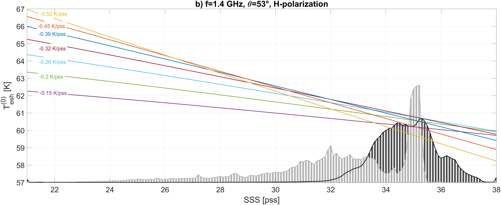
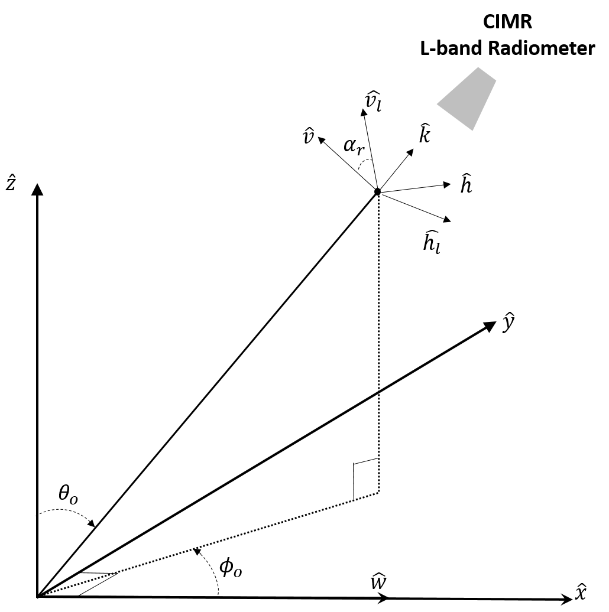
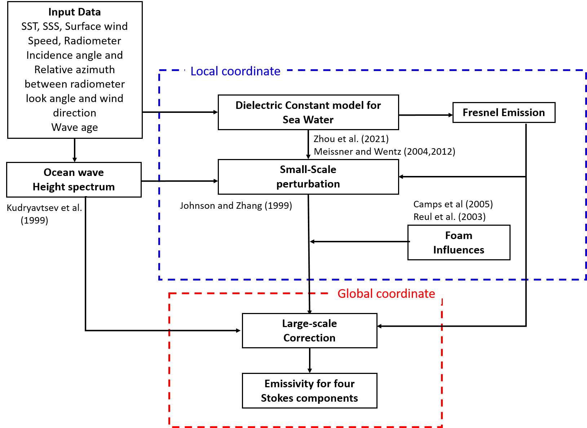
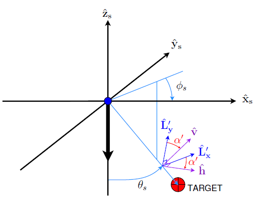
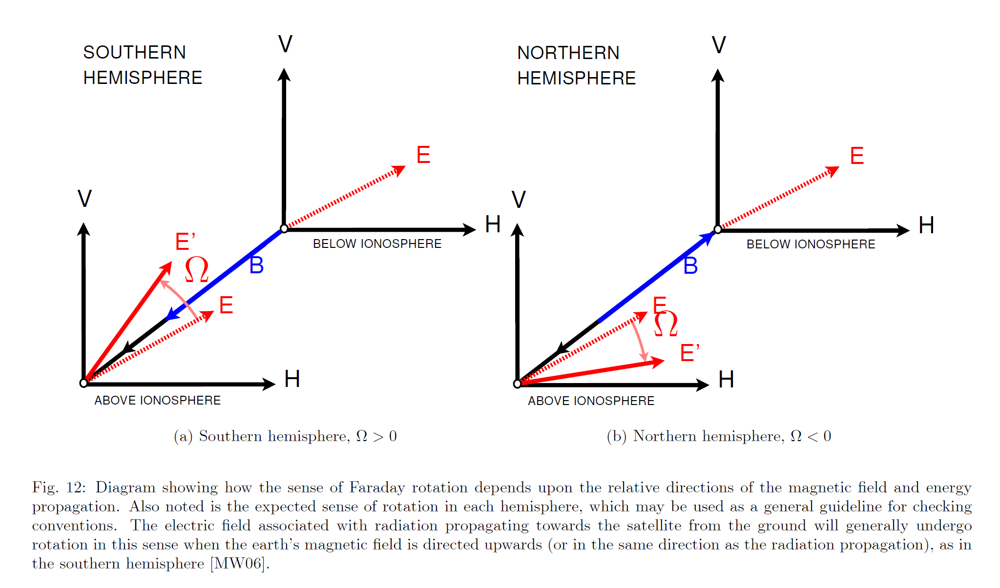
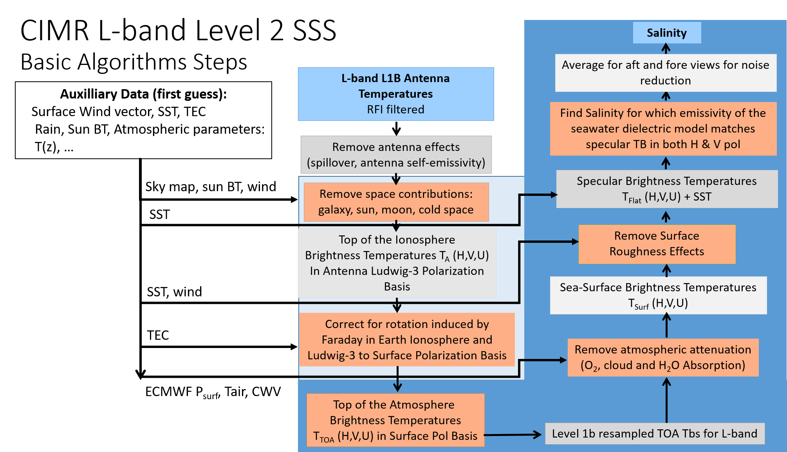

# Baseline Algorithm Definition


### Sea Surface Salinity retrieval from Satellite Antenna brightness temperature at L-band


```
--- 
name: Figure8
---
signals received by a Space borne L-band radiometer 

```

As illustrated in Figure 8, several geophysical parameters other than seawater salinity and temperature contribute significantly to L-band $T_{B}$ measured by satellite sensors at antenna level (e.g., see Yueh et al., 2001; Font et al., 2004, Reul et al., 2020). To properly retrieve SSS, these contributions need to be accurately known and used in corrections of measured, or forward model simulations, of antenna $T_{B}$. They include:  the direct and earth-reflected solar and sky emission (Le Vine et al. 2005; Reul et al., 2007, 2008; Tenerelli et al., 2008; Dinnat and Le Vine, 2008), the Faraday rotation in the ionosphere (Yueh et al., 2000; Le Vine and Abraham, 2002; Vergely et al., 2014),  the impact of the atmosphere (Liebe et al., 1992; Skou et al., 2005; Wentz and Meissner, 2016), and the effect of sea surface roughness on L-band emissivity (Meissner et al., 2014, 2018; Yin et al. 2016; Yueh et al., 2010, 2014).   

The upwelling brightness temperatures above the atmosphere but below the ionosphere (before Faraday rotation) is referred hereafter to as the "Top of Atmosphere" brightness temperature and denoted $T_{tp}^{TOA}$ (with superscript "TOA") for upwelling signal in polarization $p$.
Considering all components of the scene brightness temperature at L-band, the complete model solution for $T_{tp}^{TOA}$, in the surface polarization basis, is:


$$
\left(\begin{matrix}
T_{th}^{TOA} \\ 
T_{tv}^{TOA} \\
U^{TOA} \\
V^{TOA}
\end{matrix}\right)=
\left(\begin{matrix}
T_{atm}^{up}+(τ_d τ_v )[T_{surf,h}^{tot}+R_{surf,h}^{tot}\cdot T_{atm}^{dw}+T_{sch}+T_{ssh}] \\
T_{atm}^{up}+(τ_d τ_v )[T_{surf,v}^{tot}+R_{surf,v}^{tot}\cdot T_{atm}^{dw}+T_{scv}+T_{ssv}] \\
(τ_d τ_v ) T_{erU} \\
(τ_d τ_v ) T_{erV} \\
\end{matrix}\right)
$$

where the only contribution to the third and fourth Stokes parameters in the surface polarization basis comes from the rough surface emission components, and in which:

| Notation | Definition | 
| :-: | :-: |
| $T_{atm}^{up}$ | Unpolarized upwelling brightness temperature of atmospheric 1-way emission [K]|
|$τ_d$ | 1-way atmospheric transmittance associated with molecular oxygen absorption [nd]|
|$τ_v$|	1-way atmospheric transmittance associated with water vapor absorption [nd]|
|$T_{surf,p}^{tot}$| p-pol brightness temperature of the total sea surface emission (specular+rough+foam) [K] |
|$R_{surf,p}^{tot}$|	reflectivity of the total sea surface (specular+rough+foam) in p-pol|
| $T_{atm}^{dw}$ | Unpolarized downwelling brightness temperature of atmospheric 1-way emission [K]|
|$T_{erU}$|	Third Stokes brightness temperature of rough surface emission (surface pol. Basis) [K]|
|$T_{erV}$|	Fourth Stokes brightness temperature of rough surface emission (surface pol. Basis) [K]|
|$T_{scp}$|	p-pol brightness temperature of scattered celestial sky radiation (surface pol. Basis) [K]|
|$T_{ssp}$|	p-pol brightness temperature of scattered solar radiation (sunglint) (surface pol. Basis) [K]|

In our algorithm (see dedicated section on atmospheric contributions further), the upwelling and downwelling atmospheric emission are assumed to  be equal :

$$T_{atm}^{up}=T_{atm}^{dw}=T_{ea}$$

where $T_{ea}$ is the unpolarized brightness temperature of vertically integrated atmospheric 1-way emission. 
In addition, the brightness temperature of the total sea surface emission, $T_{surf,p}^{tot}$ can be decomposed as follows:

$$T_{surf,p}^{tot}=T_s\cdot e_{surf,p}^{tot}=T_s\cdot\left[(1-F_f)\cdot(e_{sp}+e_{rp})\right]+T_{foam,p}=(1-F_f)\cdot(T_{esp}+T_{erp})+T_{foam,p}$$

in which:

| Notation | Definition | 
| :-: | :-: |
|$T_s$|	Sea Surface Temperature [K]|
|$e_{surf,p}^{tot}$| p (h or v)-pol total sea surface emission (specular+rough+foam) [K] |
|$F_f$|	Fractionnal area of sea surface covered by foam [nd]|
|$T_{esp}$|	p-pol brightness temperature of specular emission (surface pol. Basis) [K]|
|$T_{erp}$|	p-pol brightness temperature of rough surface emission (surface pol. Basis) [K]|
|$T_{foam,p}$| p-pol brightness temperature of the total foam-covered surface emission (surface pol. Basis) [K]|

and where we split the surface emission into three components: (i) the emission from the non-foamy perfectly sea surface $(T_{esp})$, (ii) the emission from the non-foamy rough sea surface $(T_{erp})$, and (iii), the total emission from the foam-covered sea surface $(T_{foam,p})$. Note that the total surface reflectivity is related to the total surface emissivity by $R_{surf,p}^{tot}=1-e_{surf,p}^{tot}$.

Considering all components of the scene brightness temperature at L-band, the complete model solution for the upwelling brightness temperatures above the atmosphere but below the ionosphere (before Faraday rotation) in the surface polarization basis, is, therefore in H-polarization:

$$T_{th}^{TOA}=T_{ea}+(τ_d τ_v )[(1-F_f)\cdot(T_{esh}+T_{erh})+T_{foam,h}+R_{surf,h}^{tot}\cdot T_{ea}+T_{sch}+T_{ssh}]$$

and in V-polarization:

$$T_{tv}^{TOA}=T_{ea}+(τ_d τ_v )[(1-F_f)\cdot(T_{esv}+T_{erv})+T_{foam,v}+R_{surf,v}^{tot}\cdot T_{ea}+T_{scv}+T_{ssv}]$$

in which:

| Notation | Definition | 
| :-: | :-: |
|$T_{esh}$|	H-pol brightness temperature of specular emission (surface pol. Basis) [K]|
|$T_{erh}$|	H-pol brightness temperature of rough surface emission (surface pol. Basis) [K]|
|$T_{sch}$|	H-pol brightness temperature of scattered celestial sky radiation (surface pol. Basis) [K]|
|$T_{ssh}$|	H-pol brightness temperature of scattered solar radiation (sunglint) (surface pol. Basis) [K]|
|$T_{esv}$|	V-pol brightness temperature of specular emission (surface pol. Basis) [K]|
|$T_{erv}$|	V-pol brightness temperature of rough surface emission (surface pol. Basis) [K]|
|$T_{scv}$|	V-pol brightness temperature of scattered celestial sky radiation (surface pol. Basis) [K]|
|$T_{ssv}$|	V-pol brightness temperature of scattered solar radiation (sunglint) (surface pol. Basis) [K]|
|$T_{ea}$|	Unpolarized brightness temperature of atmospheric 1-way emission [K]|
|$R_h$|	Fresnel power reflection coefficient at the surface in H-pol|
|$R_v$|	Fresnel power reflection coefficient at the surface in V-pol|
|$e_{sh}$|	Perfectly flat sea surface emissivity in H-pol|
|$e_{sv}$|	Perfectly flat sea surface emissivity in V-pol
|$e_{rh}$|	Rough surface emissivity in H-pol|
|$e_{rv}$|	Rough surface emissivity in V-pol
|$T_{erU}$|	Third Stokes brightness temperature of rough surface emission (surface pol. Basis) [K]|
|$T_{erV}$|	Fourth Stokes brightness temperature of rough surface emission (surface pol. Basis) [K]|
|$F_f$|	Fractionnal area of sea surface covered by foam [nd]|
|$T_s$|	Sea Surface Temperature [K]|
|$U_{10}$|	10-m height Sea surface wind speed modulus [m/s]|

The principle of SSS retrievals algorithms from Spaceborne L-band radiometer measurements follows two possible approaches:

Retrieval method 1 (e.g. SMOS L2):
-  a forward radiative transfer modelling of the top of the atmosphere brightness $T_{tp}^{TOA}$ from first guess geophysical values (SSS, SST, $U_{10}$, etc...),and,
- the retrieval of the geophysical parameters (SSS, SST, ..) from a minimization of the differences between the observed and modelled  $T_{tp}^{TOA}$. 

Retrieval method 2 (e.g. Aquarius & SMAP V5):
- correct the measured top of the atmosphere brightness $T_{tp}^{TOA}$ from all needed forward model contributions to estimate the perfectly flat sea surface emission.
- retrieval of the geophysical parameters (SSS, SST, ..) from a minimization of the difference between the estimated flat sea residual and a forward model of it.

Whatever the chosen retrieval method, a radiative transfer forward model is needed based on the following components:

-  a sea-water dielectric constant model at 1.4 GHz,
-  a perfectly flat sea surface emission model,
-  a surface roughness and foam-induced correction model,
-  a Radiative Transfer Model for Atmospheric corrections,
-  a scattering model to correct for sea surface scattered Solar and celestial radiation, and, 
-  a correction for geometric rotation from surface polarization basis to antenna polarization basis,
-  and, to model the $T_B$ at antenna level, a model to correct for Faraday rotation in the ionosphere.

We review these forward model components and corrections in the following subsections.

 ### Models for the Dielectric Constant of seawater at 1.4 GHZ

The model function $ε_{sw}(f, S, T)$  is a key component of the radiative transfer forward model used for sea surface salinity retrieval from L-band radiometer data. The relative permittivity (also called dielectric constant) of the seawater, is a complex function dependent on temperature and salinity. The accuracy of SSS retrievals from L-band $T_B$ strongly depends on how well the dielectric constant is known as a function of these two geophysical parameters (Lang et al., 2016). It can be estimated at any frequency within the microwave band from the Debye (1929) expression:
 
 $ε_{sw}(f, S, T)=\displaystyle ε_{\infty}+\frac{(ε_{s}(S,T)-ε_{\infty})}{1+i \omega \tau(f,S,T)}-i\frac{\sigma(f,S,T)}{\omega ε_0}$
 
 in which $\it{i}$ is the imaginary unit, $ε_{\infty}$ is the electrical permittivity at very high frequencies, $ε_{s}$ is the static dielectric constant, $\tau$ is the relaxation time, $\sigma$ is the ionic conductivity, and $ε_0$ is the permittivity of free space, where $ε_{s}$, $\tau$ and $\sigma$ are functions of $\it{T}$ and $\it{S}$. At the time the first salinity mission was developed, these functions had been evaluated historically by Stogryn (1971, 1995), Klein and Swift (1977), and Ellison et al. (1998). Klein and Swift (denoted KS hereafter) modified the Stogryn (1971) model by using a different expression for the static dielectric constant $ε_{s}(S,T)$, based on Ho and Hall (1973) and Ho et al. (1974) measurements at 2.6 and 1.4 GHz, respectively. The KS and Stogryn $ε_{sw}$ models are valid for frequencies ranging from L- to X-bands (Meissner and Wentz, 2004; 2012;Meissner et al., 2014). Following pre-launch comparisons and analyses (Camps et al., 2004; Wilson et al., 2004, Blanch and Aguasca, 2004), the KS model was selected in the Level 2 Ocean Salinity (OS) processor for the SMOS mission (SMOS-Ocean Expert Support Laboratories, 2016).  
 	An alternative model function developed by Meissner and Wentz (2004, MW hereafter) fits the dielectric constant data to a double Debye relaxation polynomial that performs best at higher frequencies. The seawater dielectric data were obtained by inverting $T_B$ measurements from the Special Sensor Microwave Imager (SSM/I) at frequencies higher than 19 GHz; measurements from Ho et al. (1974) were used to derive the model at the lower frequencies.  The MW model function was recently updated by providing small adjustments to the Debye parameters based on including results for the C-band and X-band channels of WindSat and AMSR (Meissner and Wentz, 2012, 2014).  The MW model is used in the Aquarius and SMAP SSS retrieval algorithms (Meissner et al. 2018). 
Dinnat et al. (2014) analyzed the difference in SSS retrieved by SMOS and Aquarius radiometers and found that both instruments observe similar large scale patterns, but also reported significant regional discrepancies (mostly between +/- 1 pss). SMOS SSS was found generally fresher than Aquarius SSS (within 0.2-0.5 pss depending on latitude and SST), except at the very high southern latitudes near the ice edge and in a few local (mostly coastal) areas. It was found that the differences exhibit large-scale patterns similar to SST variations. To investigate its source, Dinnat et al. (2014) reprocessed the Aquarius SSS, including the calibration, using the KS $ε_{sw}$  model that is used in SMOS processing. This reprocessing decreases the difference between Aquarius and SMOS SSS by a few tenths of a pss for SST between 6°C and 18°C while warmer waters show little change in the difference. Water colder than 3°C shows mixed results, probably due to a complex mix of error sources, such as the presence of sea ice and rough seas.  The comparison of the reprocessed Aquarius SSS with in situ data from Argo shows an improvement of a few tenths of a pss for temperatures between 6°C and 18°C. In warmer waters, both the nominal and reprocessed Aquarius data, as well as SMOS data, have a fresh SSS bias. For very cold waters (less than 3°C), the reprocessed Aquarius data using the KS model show significant degradation of the SSS in comparison with the Argo, in turn suggesting that the KS model might be in error in the lowest sea surface temperature regime.
Direct laboratory measurements of the $ε_{sw}$ at 1.413 GHz and SSS=30, 33, 35, and 38 (Lang et al., 2016) were used to develop a new model (Zhou et al., 2017) by fitting the measurements with a third-order polynomial. This new L-band $ε_{sw}$ model has been compared with KS and MW.  The authors claimed that this new model function  gives more accurate SSS at high (25°C to 30°C) and low (0.5°C to 7°C) SSTs than other existing model functions. Laboratory measurements at low SSS lead to a small increase in the accuracy of the model function.  Although the model showed improvements in salinity retrieval, it had an inconsistent behavior between
partitioned salinities. To improve the stability of the model, new dielectric measurements of seawater have been made recently 
over a broad range of salinities and temperatures to expand the data set used for developing the model function (Zhou et al., 2021). The structure of the model function has been changed from a polynomial expansion in $S$ and $T$ to a physics-based model consisting of
a Debye molecular resonance term plus a conductivity term. Each unknown parameter is expressed in $S$ and $T$ based on
the expanded measurement data set. Physical arguments have been used to limit the number of unknown coefficients in these
expressions to improve the stability of the model function. The Zhou et al. (2021)'s Debye model for the seawater dielectric
constant is used in the present algorithm, will be refered to as "GW2020", and can be expressed by:

 $ε_{sw}(f, S, T)=\displaystyle ε_{\infty}+\frac{(ε_{s-dw}(T)R_{sw-dw}(S,T)-ε_{\infty})}{1+i \omega \tau(T)}-i\frac{\sigma(f,S,T)}{\omega ε_0}$

where $S$ is the salinity of seawater in pss; $ε_0$ is the dielectric
constant of free space; $ε_{s-dw}(T)$ is the static dielectric
constant of distilled water, given by:
$$ε_{s-dw}(T)=88.0516-4.01796\times10^{-1}\cdot T-5.1027\times10^{-5}\cdot T^2+2.55892\times10^{-5}\cdot T^3$$
and $\tau(T)$  is the relaxation time of distilled water:
$$\tau(T)=1.75030\times10^{-11}-6.12993\times10^{-13}\cdot T +1.24504\times10^{-14}\cdot T^2-1.14927\times10^{-16}\cdot T^3$$

$R_{sw-dw}(S,T)$ is an additional factor in the static dielectric constant of seawater due to the presence
of ions, given by: 
$$R_{sw-dw}(S,T)=\displaystyle 1-S\cdot ( 3.97185\times10^{-3}-2.49205\times10^{-5}\cdot T-4.27558\times10^{-5}\cdot S +3.92825\times10^{-7}\cdot S\cdot T+4.15350\times10^{-7}\cdot S^2)$$

Note that $\sigma(f,S,T)$ needs to be nulled at $S=0$ since the conductivity of distilled water is close to 0. The expression of 
$\sigma(f,S,T)$ given in Zhou et al. (2021) is:

$$\sigma(f,S,T)=\sigma(f,S,0)\cdot R_{\sigma}(f,S,T)$$

where for f=1.4 GHz,

$$\sigma(f,S,0)=9.50470\times10^{-2}\cdot S -4.30858\times10^{-4}\cdot S^2+2.16182\times10^{-6}\cdot S^3$$

and

$$R_{\sigma}(f,S,T)=1+T\cdot(3.76017\times10^{-2} + 6.32830\times10^{-5}\cdot T +4.83420\times10^{-7}\cdot T^2 − 3.97484\times10^{-4}\cdot·S+6.26522\times10^{-6}\cdot S^2)$$

Using the laboratory-measurement based GSW2020's model for the sea water dielectric constant at L-band, the changes in the specular sea surface brightness temperatures at 1.4 GHz, at V- and H-polarization, for the the CIMR nominal incidence angle of 53° and as a function of sea surface salinity for different representative sea surface temperature values is shown in \ref{T0esv_GSW2020_LBand.png}:




```
--- 
name: T0esv_GSW2020_LBand.png
---
Specular sea surface brightness temperatures at 1.4 GHz, at V- (a) and H- (b) polarization, for the CIMR nominal OZA of 53° and as a function of sea surface salinity (x-axis) for different representative sea surface temperature values (colors). The gray histogram represents the non-normalized distribution of historical in situ SSS observation in the Arctic.
```

As found, the sensitivity of $T_B$ to SSS is quasi-linear for a given SST. $|\partial T_{B}/\partial SSS|$ is greater in V-polarization than in H-polarization and increases with increasing SST. In Artic conditions, $\partial T_{B}/\partial SSS$ ranges in V-polarization from -0.26 K/pss $(T_s=0°C)$ to -0.36 K/pss $(T_s=5°C)$.  With the CIMR L-band radiometer NEDT~0.3 K and in cold seas, one can therefore expect ~1 pss instrumental noise error in instantaneous recordings. 

Despite its importance for SSS remote sensing, uncertainties remain in the 1.4 GHz seawater dielectric constant model. The new GW2020 Debye model laboratory measurements combined with satellite data, will certainly help to minimize those remaining uncertainties.

### Perfectly flat sea surface emission


```{figure} ../Flat_Sea_Rad.png
--- 
name: Flat_Sea_Rad
---
Radiometer measuring the brightness temperature emitted by a perfectly flat sea surface water body. 
```

The dependence of the microwave brigthness temperature emitted by the sea surface $T_{B}$ on SSS is contained in the emissivity, $e$: $T_{B} = T \times e$, where $\it{T}$ is the sea surface temperature. The emissivity $e$ is a quantity that depends on physical and chemical properties of the water (e.g. salinity and temperature), observational conditions (incidence angle, electromagnetic frequency, polarization), as well as on the sea surface roughness. 

For a perfectly flat ocean surface the scattered electric and magnetic fields may be expressed in terms of the incident fields. The reflected electric field components $(E_{h}^{'},E_{v}^{'})$  are related to the incident components $(E_{h},E_{v})$ by the diagonal matrix equation:

$$
\begin{pmatrix}
E_{h}^{'}(\theta_s,\phi_s) \\ 
E_{v}^{'}(\theta_s,\phi_s)
\end{pmatrix}=
\begin{pmatrix}
R_{hh}^{(0)} & 0 \\ 
0 & R_{vv}^{(0)}   
\end{pmatrix}
\begin{pmatrix}
E_{h}(\theta_s,\phi_s-180°) \\ 
E_{v}(\theta_s,\phi_s-180°)
\end{pmatrix}$$	

where $(\theta_s,\phi_s)$ is the specular reflection direction for radiation incident from direction $(\theta_s,\phi_s-180°$). The superscripts on the reflection coefficients indicate that they correpond to zero order expansion in surface slope, i.e., the flat surface reflection. The flat surface reflection coefficients on the preceeding matrix are given by the Fresnel equations:

$R_{vv}^{(0)} (\theta_s,f,S,T_s)=\displaystyle\frac{\sqrt{ε_{sw}(f,S,T_s)-\sin^2⁡{\theta_s}}-ε_{sw}(f,S,T_s) \cos\theta_s}{\sqrt{ε_{sw}(f,S,T_s)-\sin^2{\theta_s}}+ε_{sw}(f,S,T_s) \cos{\theta}}$ for vertical polarization, and,

$R_{hh}^{(0)} (\theta_s,f,S,T_s)=\displaystyle\frac{\sqrt{ε_{sw}(f,S,T_s)-\sin^2⁡\theta}-\cos\theta_s}{\sqrt{ε_{sw}(f,S,T_s)-\sin^2⁡θ_s}+\cos\theta_s}$  for horizontal polarization.

In the expression above, $ε_{sw}(f, S, T_s)$ is the dielectric constant of sea water at electromagnetic frequency, $\it{f}$,
for a water body with salinity $\it{S}$ and temperature, $\it{T_s}$.
The Mueller-Stokes Matrix for Fresnel's reflection equation is:

$$
T'=
\begin{pmatrix}
T_{h}^{'} \\ 
T_{v}^{'} \\
U^{'} \\
V^{'}
\end{pmatrix}=
\begin{pmatrix}
|R_{hh}^{(0)}|^2 \delta^2 & 0 & 0 & 0 \\ 
0 & |R_{vv}^{(0)}|^2 \delta^2 & 0 & 0 \\
0 & 0 & \Re (R_{hh}^{(0)}(R_{vv}^{(0)})^{\ast})  & \Im{(R_{hh}^{(0)}(R_{vv}^{(0)})^{\ast})} \\
0 & 0 & -\Im (R_{hh}^{(0)}(R_{vv}^{(0)})^{\ast}) & \Re{(R_{hh}^{(0)}(R_{vv}^{(0)})^{\ast})}
\end{pmatrix}
\begin{pmatrix}
T_{h} \\ 
T_{v} \\
U \\
V
\end{pmatrix}
$$

where $\delta$ is the Kroneker delta, $\Re$ and $\Im$ are the real and imaginary part, respectively. For a perfectly flat ocean surface with salinity, $\it{S}$, temperature, $\it{T_s}$, and observed at incidence angle $\theta$, the emissivity at polarization, $\it{p}$ (horizontal or vertical), and electromagnetic frequency, $\it{f}$, (note that we quote the center of a microwave frequency bandwidth associated with a given radiometer) is given by Peake (1959):

$e_{sp}^{(0)} (\theta_s,f,S,T_s)=1-|R_{pp}^{(0)} (\theta_s,f,S,T_s)|^2$

The specular brightness temperature emitted by the sea surface in horizontal polarization is then

$T_{esh}^{(0)} (\theta_s,f,S,T_s)=T_{s}[1-|R_{hh}^{(0)} (\theta_s,f,S,T_s)|^2]$

and in vertical polarization:

$T_{esv}^{(0)} (\theta_s,f,S,T_s)=T_{s}[1-|R_{vv}^{(0)} (\theta_s,f,S,T_s)|^2]$

where $R_{pp}^{(0)}$  is the Fresnel reflection coefficient given above.


As shown in \ref{Figure3b}, the specular brightness temperature sensitivity to SSS $\partial T_{esp}/\partial SSS$ increases with decreasing electromagnetic frequency, peaking at ~1 GHz (L-band) and with increasing incidence angle.  As the frequency band 1.400 to 1.427 GHz is protected for radio-astronomy observation, it has been used for SSS remote sensing.

Given a model for $ε_{sw}(f, S, T)$, in its simplest form, SSS remote sensing, therefore, consists of measuring/estimating the L-band $T_{esp}$ emitted by the perfectly flat ocean surface together with an auxilliary SST. The intersection of the two values on a graph such as shown in Figure \ref{Figure3b} can then be used to retrieve SSS. 


```
--- 
name: Figure3b
---
First Stokes parameter of the Brightness temperature $$(T_{esh}+T_{esv})/2$$ changes at 1.4 GHz and nadir of the perfectly flat sea surface as a function of salinity (x-axis) and temperature (colors). The gray domain indicates the range of SSS values mostly encountered in the open ocean. 
```


###  Surface roughness-induced emission model at L-band ###


#### Physics of the problem ####

At a given frequency, the total surface emissivity $E_p$ can be modeled with a specular part $e_{sp}^{(0)} (\theta_s,S,T_s)$ and a part caused by ocean roughness $e_{rp}^{rough}$. In order to measure sea surface salinity with the required accuracy it is necessary to remove the ocean surface roughness signal from the observed CIMR brightness temperatures. This requires an accurate
knowledge of the signal itself as well as the ocean surface wind speed. Wind-induced surface waves are the primary contributor to
ocean surface roughness, with internal waves, wind-current
interactions, and ship wakes to be important but secondary
contributors (Gasiewski and Kunkee, 1994). Wind-induced waves can be divided into two
primary scales (Yueh, 1997):  1) large-scale gravity waves and 2) smallscale gravity capillary waves riding atop the large-scale gravity
waves (Johnson and Zhang, 1999). 

- The large-scale waves cause the local surface incidence angle to differ from the effective earth incidence
angle, and mix vertical and horizontal polarizations (Gasiewski and Kunkee, 1994). 

- The small-scale waves modify the specular surface reflection (or emission) through the bistatic scattering of the radiation incident
upon the ocean surface. 

Development and analysis of the two-scale model for ocean waves and resulting microwave ocean emissivities were presented in (Yueh, 1997) and (Yueh et al., 1994, 1999; Johnson 2006; Ma et al., 2021; Lee and Gasiewski, 2022), within which were published two-scale model algorithms that have 
been successfully used to date for the prediction of ocean wave influences on surface emission.
Ocean foam (i.e., white capping) is an air–sea mixture caused by ocean wave breaking and is an additional
surface process that strongly increases ocean surface emissivity (Monahan and O’Muircheartaigh, 1986; Stogryn, 1972; Reul et al. 2003; Camps et al., 2005) at microwave frequencies due to its near-blackbody behavior. As wind speed increases, ocean foam coverage also increases, resulting in a large
discrepancy between two-scale emissivity calculations made with and without consideration of foam coverage. The
quasi-blackbody models used for both foam emissivity and coverage are in themselves of limited accuracy due to the
paucity of in situ observations for both foam coverage and emissivity that have been able to be made in conjunction with
brightness temperatures from passive microwave instruments. In spite of numerous efforts to derive a suitable empirical
relationship between foam coverage and ocean surface wind speed (Monahan and O’Muircheartaigh, 1986; Erickson et al., 1986; Asher et al., 2002; Bondur and Sharkov, 1982; Anguelova and Webstern 2006; Callaghan et al., 2006), there is to date no universally accepted relationship between them due to the variable conditions under
which foam is produced, as well as its spatial inhomogeneity. This shortcoming is especially true for breaking waves caused by shoaling. Smith et al. (2008) found that the differences in surface-referenced microwave brightness temperatures between WindSat observations and a two-scale model
developed by Johnson (2006) were significant, especially in the zeroth-azimuthal-harmonic components of ocean brightness
at a wind speed of 8–20 m/s. The discrepancy was largely due to foam coverage and emissivity models. They concluded
that an empirical tuning process using observed satellite data is needed to model ocean surface emissivity with enough precision
for general retrieval and data assimilation applications. 

The limitations on the various purely physical published models on the ocean surface emissivity include a limited
range of validity in frequency and incidence angle. Combined physical and empirical models have been used to correct for
these shortcomings but do not necessarily permit extension of the models to arbitrary frequencies and incidence angles,
as required for the design and development of new observation systems. The intent of the study has been to synthesize the
most relevant of the various purely physical models and observational data that have been collected over more than a fouryear
period into an updated model while making corrections to key errors that have propagated in the literature into the
physical models used as a basis for much contemporary work in passive microwave radiative transfer modeling.


In this algorithm, a full Stokes vector model for ocean surface emissivity based on the two-scale approach is used,
applicable at arbitrary microwave frequencies, incidence and azimuth angles, and polarizations, and subsequently tuned
within a limited set of selected model parameters against Aquarius and SMAP observations from 0- to 20-m/s wind speeds.


##### Two-scale Approach

##### Mathematical description

The two-scale ocean surface emissivity model approximates ocean surface emission statistics using two spectral scales by considering small-scale capillary waves as riding on the top of large-scale gravity waves (Yueh et al., 1997). The total thermal emission is calculated by integration of the rough surface spectral emission
from each statistically tilted facet, wherein the tilt is governed by the large-scale gravity wave spectrum. In the two-scale
model, the full Stokes vector for the emissivity from a tilted facet is calculated in the local polarization coordinate system
for convenience and then transformed into the global (or Earth-centric) polarization coordinate basis. A rotation matrix $\overline{\overline{R}}$ is
used to convert the Stokes emission vector defined in the local polarization basis into that of the global polarization basis [Johnson, 2006].
The calculation can be written as


$$
e_{rp}^{rough}=\overline{e}_g=\overline{\overline{R}} \cdot \left\[(1-F_r)\overline{e}_l+F_r \overline{e}_F\right\]
$$

where $\overline{e}_l$ and $\overline{e}_g$ are the Stokes emissivity vectors in the local
and global coordinates, respectively, $F_r$ is the ocean foam
fractional coverage of the facet, and $\overline{e}_F$ is the emissivity vector
for a fully foam-covered surface facet. The Stokes emissivity
vector in the local facet coordinate system is defined as

$$
\overline{e_l} \equiv
\begin{pmatrix}
e_{v,l} \\
e_{h,l} \\
e_{U,l} \\
e_{V,l} \\
\end{pmatrix}
=\displaystyle\frac{\overline{T}_{B,l}}{T_S}
$$

 where $e_{v,l}, e_{h,l}, e_{U,l}$ and $e_{V,l}$ are the ocean surface emissivities for vertical polarization, horizontal polarization, and third and
fourth Stokes emissivity components in the local facet-normal coordinate system, respectively. The third and fourth Stokes
components represent the in-phase and quadrature cross-correlations between the upwelling vertical and horizontal polarized electric-field components, respectively.
The vector $\overline{T}_{B,l}$ is the Stokes vector of upwelling microwave thermal emission propagating at angles $(\theta_l,\phi_l)$ from the facet under the
condition of zero downwelling radiation, and $T_s$ is the surface physical temperature associated with microwave penetration depths of ~1 cm. 
 
 The rotation matrix $\overline{\overline{R}}$ is
 
 $$
\overline{\overline{R}} =
\begin{pmatrix}
\cos^2{\alpha_r} & \sin^2{\alpha_r} & \frac{1}{2}\sin{2\alpha_r} & 0 \\
\sin^2{\alpha_r} & \cos^2{\alpha_r} & -\frac{1}{2}\sin{2\alpha_r} & 0 \\
-\sin{2\alpha_r} & \sin{2\alpha_r} & \cos{2\alpha_r} & 0 \\
0 & 0 & 0 & 1
\end{pmatrix}
$$
 
 where $\alpha_r$ is the polarization rotation angle between the local and global polarization systems defined in Fig. \ref{Conf_coordinate_system} and
Appendix A. This matrix is a function of the surface slopes and observation direction. A derivation of the rotation matrix is provided in Appendix A.



```
--- 
name: Conf_coordinate_system
---
Configuration and coordinate system used in this ATBD.  
```

The Stokes emissivity vector for small-scale emission is effectively averaged over the slope distributions of the large-scale
waves. In addition to the polarization basis rotation angle, the tilt angles due to large-scale waves also affect the
projected facet area in the direction of observation. In effect, the emission from tilted facets analyzed using the small-scale
emission theory is weighted by the subtended solid angle of the large-scale slanted surface as viewed by the observer (Yueh et al., 1997). This
effect is considered by multiplying by a factor of $1-S_x\tan{\theta_o}$ in the global emissivity integrand for the integration over the
slope distributions of the large-scale waves. The derivation of this factor can be found in Appendix B.
 
 Accordingly, the two-scale ocean surface emissivity vector $\overline{e}$ is calculated as
 
 $$
 \overline{e_{rough}}(\theta_o,\phi_o)=\displaystyle\int_{-\infty}^{\infty}\int_{-\infty}^{\cot{\theta_o}} \overline{e_g}(\theta_o,\phi_o;S_x,S_y)\times (1-S_x\tan{\theta_o}) P(S'_x,S'_y)dS_xdS_y
 $$
 
where $S_x$ and $S_y$ are the surface slopes in along- and across-radiometer
look directions, respectively, $\theta_o$ is the Earth observation
angle with respect to the local zenith direction of the mean surface, and $\phi_o$ is the relative azimuth angle between
wind and radiometer look directions.  $S_x$ and $S_y$ are calculated from the slopes in the upwind and crosswind directions along with the azimuth angle $\phi_o$:

$$
\begin{pmatrix}
S_x' \\
S_y' \\
\end{pmatrix}=
\begin{pmatrix}
\cos{\phi_o} & -\sin{\phi_o} \\
\sin{\phi_o} & \cos{\phi_o} \\
\end{pmatrix}
\cdot
\begin{pmatrix}
S_x \\
S_y \\
\end{pmatrix}
$$

where $S_x'$ and $S_y'$  are the surface slopes in upwind and crosswind
coordinate system directions, respectively. In this ATBD, the
upwind direction is fixed along the negative x-axis (i.e., the wind direction vector points in the positive x-direction).
A description of the geometry can be found in Fig.\ref{Conf_coordinate_system}. The
integration over the upwind direction in the two-scale ocean surface emissivity is limited to $\cot{\theta_o}$ 
to preclude slopes that impart shadowing by large-scale waves in the direction of the observer.



```
--- 
name: TSM_Flowchart
---
Flowchart of the two-scale microwave rough ocean surface emissivity model used in this ATBD.  
```

The two-scale model consists of five distinct physical modules (see Fig. \ref{TSM_Flowchart}):

- Sea water dielectric constant model (already provided in previous section),
- Ocean Wave Height Spectrum,
- Small-scale perturbation,
- Foam Influences,
- Large Scale corrections,


Each of these four last modules is discussed and clarified relative to the published literature described in the
following.

###### Ocean Wave Height Spectrum Model

In the present algorithm, we use the semiempirical spectrum model developed by V. N. Kudryavtsev and co-authors (Kudryavtsev et al., 1999,
2003, 2005; Appendix A in Yurovskaya et al., 2013). The spatial spectrum of curvatures for short waves is calculated by solving the energy balance equation taking into account the wind effect, resonant nonlinear wave‐wave interactions, viscous dissipation, wave breaking, and generation of short waves by longer wave
breaking. The equation includes several parameters whose values are chosen by the best fit to the experimental data.
The Kudryavtsev spectrum model proposed in the first papers (Kudryavtsev et al., 1999, 2003) had a gap in
the gravity‐capillary range (see Fig. 4 in Kudryavtsev et al., 2003). In 2013, the spectrum was improved using
new experimental data. Data of a full‐scale experiment on stereographic measuring of the two‐dimensional
spectrum with wavelengths from several millimeters to several centimeters are presented in paper
(Yurovskaya et al., 2013). Based on the data of this experiment, the Kudryavtsev spectrum was modified.
The measurements were carried out at wind speeds $U_{10} from 5 to 15 m/s. The wind fetch in the wave model is taken into account in the same way as in the Elfouhaily's 1997 model (see equation (17) and here below section on Low-wavenumber spectrum). The long‐wavelength part of the spectrum is calculated by the model given in Donelan et al. (1985). The transition between long‐ and short‐wavelength parts of the spectrum is described by the same exponential factor as it was in Elfouhaily's 1997 spectrum (equation (16)). Thus, the spatial spectrum of curvatures is presented as:

$$B(\vec{k},U_{10})=B_{lw}(\vec{k},U_{10},c_p/U_{10})\times F_{p} + B_{sw}(\vec{k},U_{10})\times (1-F_{p})$$.


where $B_{lw}$ and $B_{sw}$ are the respective curvature spectrum contributions from low and high wavenumbers and where $c_p/U_{10}$ is the wave age.

The result of solving the energy balance equation is an asymmetric spectrum of surface waves, which shows
that downwind propagation of a small ripple is more likely than the upwind one. The long‐wavelength spectrum
in the paper by Donelan et al. (1985) also has an asymmetric spreading function.
A detailed description of the spectrum can be found in Yurovskaya et al. (2013), Appendix A. We provide the main parts of the spectral model here below:


####### Low-wavenumber spectrum

In Kudryatsev et al. [1999]'s model, the low-wavenumber curvature spectrum $B_{lw}$ follows the
approach suggested by Elfouhaily et al. (1987):  $B_{lw}$ is assumed to obey Donelan et al. (1985):

$$B_{lw}=\alpha_p L_{PM} F_p c(k_p)/2c(k_{\rho}') $$

The parameters in the above equation are dependent on $U_{10}$, and on inverse wave age $\Omega=U_{10}/c(k_p)$, where $c(k_p)$ is the phase speed at $k_p$, the wavenumber at the spectral peak.

$$ 
\begin{matrix}
\alpha_p=0.006 \Omega^{1/2} & k_p=g \Omega^{2}/U^2_{10} \\
c(k_{\rho}')=\left\[g(1+k_{\rho}^{'2}/k_{m}^{2})/k^{'}_{\rho}\right\]^{1/2} \\
\end{matrix}
$$

where $g$ is gravitational constant and $k_m$=370 rad.m$^{-1}$. The function $F_p$ is given by:

$$
F_p=\gamma^{\Gamma}\exp{[-\Omega[(k_{\rho}'/k_{\rho})^{1/2}-1]\sqrt{10}]}
$$

where

$$
\left\{
\begin{array}\\
    \gamma=1.7 & \mbox{if } \ 0.84 < \Omega\leq 1 \\
   \gamma=1.7+6\mathrm{log}(\omega) & \mbox{if } \ 1 < \Omega\le 5 \\
        \end{array}
\right.
$$

and where

$$
\Gamma=\exp{(-[(k_{\rho}'/k_{\rho})^{1/2}-1]^2/2\sigma^2)} \ \ \ \ \sigma=0.08(1+4/\Omega^3)
$$


The function $F_p(k/k_p)$ is the high-frequency ‘‘cut-off’’ function, suppressing $B_{lw}$ at wave numbers exceeding $10 k_p$ $(k_p$ is wave number of the spectral peak).

The Pierson-Mosckowitz shape spectrum $L_{PM}$ is defined as follows:

$$
L_{PM}=\exp{[-\frac{5}{4}(k_{\rho}'/k_{\rho})^{-2}]}
$$

####### High-wavenumber spectrum

The main features of the Kudryavtsev et aL. (1999)'s spectral form is a  physical model of the short wind wave
spectrum $B_{sw}(\vec{k},U_{10})$ in the wavelength range from a few millimeters to few meters which take into
account statistical properties of breaking waves and mechanism of generation of capillaries. The spectrum shape results from the solution of the energy spectral density balance equation:
$$
Q(B)=\displaystyle\beta_{\nu}(\mathbf{k})B(\mathbf{k})-B(\mathbf{k})\left\(\displaystyle\frac{B(\mathbf{k})}{\alpha}\right\)^n+Q_b(\mathbf{k})=0
$$

where $Q(B)$  is the total spectral energy source represented as a sum of the effective wind forcing, nonlinear energy
losses (associated with wave breaking in the gravity range, and a nonlinear quadratic limitation of the spectral level in
the capillary-gravity and capillary range), generation of short waves by breaking of longer waves $Q_b$ including
generation of parasitic capillaries. In this equation $B(\mathbf{k})$ is
the saturation spectrum, $\beta_{\nu}(\mathbf{k})=\beta(\mathbf{k})-4\nu k^2 /\omega$ is the
effective growth rate, which is the difference between the
wind growth rate, $\beta(\mathbf{k})$, and the rate of viscous dissipation, $\alpha$ and $n$  are tuning functions of $k/k_{\gamma}$ , which are equal to constants $\alpha=\alpha_g$, $n=n_g$ at $k/k_{\gamma}\lt\lt 1$,  and equal to otherconstants (e.g., n=1) at $k/k_{\gamma}\gt 1$, $k_{\gamma}=\sqrt{g/\gamma}$ -wave
number of minimum phase velocity. Wind wave growth rate is parameterized as suggested
in Kudryavtsev and Makin (2004):

$$
\beta(\vec{k})=c_{\beta}(1+cos^2\phi)u_{\star}(U_k\cos\phi-c)/c^2
$$

where $c_{\beta}$ is constant $(c_{\beta}=1.2\cdot 10^{-3})$, $U_{k}$ is mean wind velocity at $z=k^{-1}$. The source term $Q_b=Q_b^{pc}+Q_b^{w}$ describes generation of short surface waves by wave breaking.
Depending on the scale of a breaking wave, two mechanisms are specified. First, due to the effect of the surface
tension, short breaking waves with $k\gt k_b$ (where $k_b$ is of order $k_b~10^2$ rad/m) are not disrupted, but produce ‘‘regular’’
trains of parasitic capillaries (bound waves). These
parasitic capillaries provide energy losses in breaking
waves. Therefore, rate of generation of parasitic capillaries
is equal to the energy dissipation by the carrying short
gravity wave at wave number $K=k_{\gamma}^2$:

$$
Q_{b}^{pc}(\mathbf{k})=\phi(k)\left\[B(B/\alpha)^n\right\]_{k=K}
$$

where $\phi(k)$ is a filter function restricting generation of parasitic
capillaries in wave number space. The crests of longer
breaking waves with wave number $k\lt k_b$ disrupt and produce
mechanical perturbations of the sea surface. These
mechanical perturbations generate ‘‘freely’’ propagating
surface waves in all directions as reported by Rozenberg
and Ritter (2005). The rate of their generation is defined by

$$
Q_{b}^{\omega}=c_{b}\omega^{-1}\int\int_{k\lt k_{bm}}\omega\beta(\mathbf{k})B(\mathbf{k}) dlnk d\phi
$$

where $c_b$ is an empirical constant (here $c_b=4.5\cdot 10^{-3}$); $k_{bm}=min(k/10,k_b)$ is the upper limit of integration defining interval of breaking waves which generate freely propagating short waves at wave number $k$.

The wave spectrum in the equilibrium range, $B_{sw}$, can be represented as a superposition of the spectrum of freely propagating waves (generated by the wind per se and by wave breaking; hereinafter these waves are called as wind waves), $B_{w}$, and the spectrum of parasitic capillaries (bound waves), $B_{pc}$, generated on the crests of that freely propagating waves:

$$
B_{sw}(\vec{k})=B_{w}(\vec{k})+B_{pc}(\vec{k})
$$

where $B_{w}$ represents the contribution from short gravity and gravity-capillary waves while $B_{cap}$ is the contribution from capillary waves. Either $B_w$ and $B_{pc}$ spectra are difined as solution of the energy balance equation. For the wind wave spectrum the wave breaking source $Q_b$ in the energy source equation is $Q_{b}=Q^w_b$. Solution of such a nonlinear algebraic equation is not straightforward (index of
power has an arbitrary value). However, it can be effectively found by iterations on the basis of its known asymptotic solutions at up-wind, down-wind, and cross-wind directions. Aligned in the wind directions, the wave breaking source $Q^w_b$ is expected to be small in comparison with
direct wind energy input. Then approximate solution in
down-wind direction is

$$
B_w^d=\alpha\beta_{\nu}^{1/n}
$$

At cross-wind directions, where the effective wind
input is small or vanishing, $\beta_{\nu}\simeq 0$, the wave spectrum
approximately reads:

$$
B_w^{cr}=\alpha^{n/(n+1)}(Q^w_b)^{1/(n+1)}
$$


At the up-wind directions, where $\beta_{\nu}(\mathbf{k})\lt 0$, one
may anticipate the low spectral density, thus nonlinear term
in the energy balance equation can be omitted, and $B_w$ results from the
balance of wave breaking source and energy losses due to
viscosity and interaction with the opposing wind:

$$
B_{w}^{up}\sim-I_{wb}/\beta_{\nu}
$$

Combination of these three "asymptotic" solutions,

$$
B_{w}^{0}=\mathrm{max}\left\[B_w^d,\mathrm{min}(B_w^{cr},B_w^{up})\right]
$$

provides a first guess for wave spectrum. Next iteration for
wave spectrum is defined by

$$
B_{w}^{j}=B_{w}^{j-1}-[Q(B_w)/(\partial Q/\partial B_w)]_{B_w=B_w^{j-1}}
$$

where $Q(B_w)$ is the total energy source function  for
wind waves (where $Q_b$ is equal to $Q_b=Q_b^w$). Practically,
the iteration scheme $B_{w}^{j}$ with the first-guess solution $B_{w}^{0}$
converges to the exact solution after three iterations.

Spectrum of parasitic capillaries results from the
same energy balance equation where the parasitic capillary
term, $Q_b=Q_b^{pc}$, is the only energy source (wind forcing
is omitted) which is balanced by viscous and nonlinear
dissipation. Solution of this equation is straightforward and
reads:

$$
B_{pc}(\mathbf{k})=\displaystyle\frac{\alpha}{2}\left\[-4\nu k^2/\omega+\sqrt{(4\nu k^2/\omega)^2+4Q_{b}^{pc}(\mathbf{k})/\alpha}\right]
$$

with $Q_b^{pc}$  defined by relation above for the wind wave spectrum $B_w$. Now to complete the model we need to define the model functions, $n(k/k_{\gamma})$ and $\alpha(k/k_{\gamma})$, following kudryavtsev et al. (2003). The key function $n(k/k_{\gamma})$ is related to the wind exponent $m=2/n(k/k_{\gamma})$. Its shape is specified as:

$$
\displaystyle\frac{1}{n(k/k_{\gamma})}=(1-\frac{1}{n_g})f(k/k_{\gamma})+\frac{1}{n_g}
$$

where $f(k/k_{\gamma})$ is a tuning function satisfying conditions, $f\rightarrow 0$ at $k/k_{\gamma}\lt\lt1$, and $f\rightarrow 1$ at $k/k_{\gamma}\sim 1$. In order to fit wind exponent determined from observations, the tuning function $f(k/k_{\gamma})$ is defined as:

$$
f(k/k_{\gamma})=[1+\mathrm{tanh}(2(\zeta-\zeta_b))]/2
$$

where $\zeta=\mathrm{ln}k$, $\zeta_b=\mathrm{ln}k_b$ and $k_b$ is a wave number corresponding
to center of transition interval which is fixed at $k_b=1/4k_{\gamma}$. Parameter $n_g$ is fixed at $n_g=10$ in order to be consistent with Banner et al. [1989] data. As argued in Kudryavtsev et al. [2003], the other
tuning function, $\alpha(k/k_{\gamma})$, is linked to $n(k/k_{\gamma})$ as 

$$
\mathrm{ln}\left\[\alpha(k/k_{\gamma})\right\]=\mathrm{ln} a -\mathrm{ln} (\bar{C_{\beta}})/n(k/k_{\gamma})
$$

with $\bar{C_{\beta}}=0.03$ as a mean value of the growth rate, and $a$ is
a constant which is chosen as $a=2\cdot 10^{-3}$ in order to get
right value of the sea surface MSS.

The filter function  $\phi(k)$ restricting action of the parasitic
capillaries source is refined to be consistent with
spectral behavior of f-function defining nonlinear
dissipation. The ‘‘high-frequency’’ cut-off of
$\phi(k)$ must be linked to the transition wave number, $k_b$, as
$k_{pc}^{h}=k_{\gamma}^2/k_b$, while the low-frequency cut-off of 
$\phi(k)$ to be $k_{pc}^{l}=nk_{\gamma}$ where $n$ should be about $n=2$, but the authors fixed it at
n=3/2 in order to get location of the parasitic capillaries peak as observed in the experiments. Thus the filter function is

$$
\phi(k)=f(k/k_{pc}^{l})-f(k/k_{pc}^{h})
$$

Following the model construction, the wind exponent
parameter $m=2/n(k/k_{\gamma})$, also imposes the angular
distribution, as $B(\cos(\phi)^{2/n}$.  The measured
spectrum is a folded spectrum, $B_j(\mathbf{k})$, that relates to the directional spectrum as 

$$
B_j(\mathbf{k})=[B(\mathbf{k})+B(-\mathbf{k})]/2
$$

The angular modulation parameter, $\Delta$, of the folded
spectra can be expressed through the directional spectrum
in up-wind, down-wind, and cross-wind directions (spectra
correspondingly) as:

$$
\Delta(k)=\displaystyle\frac{\pi}{2}\frac{B_{up}+B_{d}-2B_{cr}}{B_o}
$$

where $B_o$ is omnidirectional (integrated over all directions)
spectrum.

###### Small-Scale Perturbation Model


Following the initial formulation of the small-scale perturbation model by Yueh (1997), a computationally efficient and
physically intuitive reformulation of the model by Johnson and Zhang (1999) was developed and is used in this algorithm.
In this model, the local surface emissivity $e_l$ can be calculated
based on the Fresnel reflection coefficients incorporated into the small-scale surface emissivity perturbation model (Yueh, 1997; Johnson, 2006):

By this process, the local sea surface emissivity vector can
be written as a sum of Fresnel emissivities and the emissivity
perturbation $\Delta \bar{e_{ss}}$ caused by small-scale roughness, namely,

$$
\bar{e_{ss}}=
\left\(
\begin{bmatrix}
1-|R_{vv}^{(0)}|^2 \\
1-|R_{hh}^{(0)}|^2 \\
0 \\
0 \\
\end{bmatrix}
-\Delta \bar{e_{ss}}
\right\)
$$
$$

where $R_{vv}^{(0)}$ and $R_{hh}^{(0)}$ are the Fresnel reflection coefficients
at vertical and horizontal polarizations, respectively. 

Sea surface microwave emission for a given frequency and viewing geometry depends upon the sea water dielectric constant as well as sea surface roughness and sea foam. From detailed analyses presented in Johnson and Zhang (1999), the sea roughness contribution to the surface emissivity $\Delta \bar{e_{ss}}$ can be treated as the product of an electromagnetic weighting function and the sea surface roughness spectrum integrated over all surface wavelengths. The weighting function shows resonance peaks in the neighborhood of surface wavelengths with scales comparable to the electromagnetic wavelength (i.e., 21 cm for the L-band):
According to (Yueh, 1997; Johnson, 2006), the emissivity perturbation $\Delta \bar{e_{ss}}$ in
the local polarization coordinate system with local incidence angle $\theta_l$ and local azimuthal angle $\phi_l$  can be determined as:

$$
\Delta \overline{e}_{ss}=
\left[\begin{matrix}
\Delta \overline{e}_{ssh} \\ 
\Delta \overline{e}_{ssv} \\
\Delta \overline{e}_{ssU} \\
\Delta \overline{e}_{ssV} \\
\end{matrix}\right\]=
\displaystyle\int_{k_{l}}^{k_{u}}\int_o^{2\pi}k_{\rho}'{W(k_{\rho}',\phi'+\phi_l)} 
\left[
\begin{matrix}
g_h(f,\theta_l,\phi_l,\epsilon_{sw},k_{\rho}',\phi')\\
g_v(f,\theta_l,\phi_l,\epsilon_{sw},k_{\rho}',\phi')\\
g_U(f,\theta_l,\phi_l,\epsilon_{sw},k_{\rho}',\phi')\\
g_V(f,\theta_l,\phi_l,\epsilon_{sw},k_{\rho}',\phi')\\
\end{matrix}
\right]
k_{\rho}'dk_{\rho}'d\phi'
$$

where $k_l$ and $k_u$  represent the lower and upper cutoff spectrum
wavenumbers for short ocean waves. The functions $g_i$ (i = v,
h, U, and V ) are the second-order weighting functions from
the small perturbation method [6], and the detailed information
and formulation of $g_i$ are provided as:


$$
\begin{matrix}
g_h=2\Re{\left[R_{hh}^{(0)\star}f_{hh}^{(2)}\right]} +\displaystyle\frac{k_{zl}}{k_z}\left[|f_{hh}^{(1)}|^2+|f_{hv}^{(1)}|^2\right]F\\
g_v=2\Re{\left[R_{vv}^{(0)\star}f_{vv}^{(2)}\right]}+\displaystyle\frac{k_{zl}}{k_z}\left[|f_{vv}^{(1)}|^2+|f_{vh}^{(1)}|^2\right]F\\
g_U=2\Re{\left[(R_{hh}^{(0)\star}-R_{vv}^{(0)\star})f_{hv}^{(2)}\right]}+\displaystyle\frac{2k_{zl}}{k_z}\Re{\left[f_{vh}^{(1)}f_{hh}^{(1)\star}+f_{vv}^{(1)}f_{hv}^{(1)\star}\right]}F\\
g_V=2\Im{\left[(R_{hh}^{(0)\star}+R_{vv}^{(0)\star})f_{hv}^{(2)}\right]}+\displaystyle\frac{2k_{zl}}{k_z}\Im{\left[f_{vh}^{(1)}f_{hh}^{(1)\star}+f_{vv}^{(1)}f_{hv}^{(1)\star}\right]}F\\
\end{matrix}
$$

In the above equations, $\Re$ and $\Im$ represent the real
and imaginary part operators respectively, $k_o=2\pi/\lambda_o$ is
the electromagnetic wavenumber, $k_{zl}=k_o\cos(\theta_l)$, and
$f_{\alpha\beta}^{(1)}$ and $f_{\alpha\beta}^{(2)}$ are the first
and second order SPM scattering coefficients as given in the
appendix A with some modification given below. The first terms in
the above $g_{\gamma}$ expressions represent the second order
coherent reflection coefficient contributions, while the second
terms represent the incoherent Bragg scatter contributions.

Second order scattering coefficients are exactly those taken from Yueh et
al.\cite{yuehetal94a}, with the variables $k_x$, $k_y$, and $k_z$
given by 

$$
\begin{matrix}
k_x = k_{xl} +k_{\rho'}\cos{\phi'} \\
k_y = k_{yl} +k_{\rho'}\sin{\phi'} \\
k_z = \sqrt{k_o^2-k_{x}^2-k_y^2} \\
\end{matrix}
$$

where $k_{xl} = k_o\sin{\theta_l}\cos{\phi_l}$ and $k_{yi} =k_o\sin{\theta_l}\sin{\phi_l}$. Note that $f_{hv}^{(2)}$
 is used with $g_U$ and $g_V$ as opposed to $f_{vh}^{(2)}$ in Yueh et al.(1994a) due to
an evaluation of the second order reflection coefficient in
scattered field coordinates.
First order coefficients are as given in in Yueh et
al. (1994a), except that the incident $(k_{xl},k_{yl}, k_{zl})$ and scattered $(k_x, k_y, k_z)$ variables
are first interchanged and then the above equations used to
represent $k_x$, etc. in terms of $k_{xl}$ , $k_{\rho'}$ and
$\phi'$. This set of new projected coefficients are rewritten in
appendix for completeness.

The integral in the equation  for emissivities is over all length
 scales of the ocean spectrum $(k_{\rho'}$  from $k_l$ to $k_u$; however, the integration
 of incoherent scattering coefficients should
be limited to only those length scales which produced a
propagating Bragg scattered wave. The function $\it{F}$ in the second
terms of the scattering coefficients equations indicates this fact: $\it{F}$ is
defined to be 1 for $k_z$ real, 0 for $k_z$ complex, and limits
the incoherent contributions to waves propagating in the upper
hemisphere. Evaluation of the rough surface emission is
performed through numerical integration of the double integral for
fixed values of all the radiometer and surface parameters $(f,\theta_l, \phi_l, \epsilon_{sw}, \rm{and}, W(k_{\rho'},\phi'))$.
Typical formulations based on Yueh et al. (1994a) would
numerically calculate double integrals for the coherent and
incoherent contributions separately; the above expression combines
both into one integration. This is important because the coherent
and incoherent terms when calculated separately for large height
surfaces can both obtain very large values which cancel when
combined to yield the total emission prediction. This cancellation
effect results in extremely high accuracy required in the separate
numerical integrations. Combining the two into one double integral
eliminates this problem.

Since evaluation of the integral emissiion equation results in an emissivity
vector for one value of $\phi_i$ only, studies of
brightness temperature azimuthal harmonics require repeated
evaluation of the double integral for varying values of  $\phi_i$
to produce functions of azimuth. Harmonic coefficients can then be
extracted from these functions through a Fourier transform.
Calculation of emissivities azimuthal harmonic
coefficients and their variations with other surface and
radiometer parameters can therefore be quite time consuming.


To address these issues, Johnson and Zhang (1999)
proposed to use several properties of the original $g_{\gamma}$
functions and of the surface directional spectrum and this approach is
applied in the present algorithm. First, it is widely accepted
that the ocean surface spectrum should vary as $1/k_{\rho}^{'4}$
for large values of $k_{\rho}'$; it is advantageous to remove this
dependency through use of the ocean curvature spectrum,
$C(k_{\rho}',\phi')$, defined as
$k_{\rho}^{'4}W(k_{\rho}',\phi')$. Next it is noted that the
$g_{\gamma}$ functions have a $k_o^2$ dependence on frequency
which can be factored out by defining: 

$$
\tilde{g_{\gamma}}(\theta_l,\phi_l,\epsilon_{sw},k_{\rho}'/k_o,\phi')=\frac{1}{k_o^2}g_{\gamma}(f,\theta_l,\phi_l,\epsilon_{sw},k_{\rho}',\phi')
$$

with the resulting $\tilde{g_{\gamma}}$ functions depending on
frequency only through: $\displaystyle\frac{k_{\rho}'}{k_o}$. Using these ideas and re-writing the second order change in emissivity from a flat surface $(\Delta e_{\gamma})$ in terms of
$\beta=k_{\rho}'/k_o$ yields

$$
\left[
\begin{matrix}
\Delta \bar{e_{ssh}} \\
\Delta \bar{e_{ssv}} \\
\Delta \bar{e_{ssU}}\\
\Delta \bar{e_{ssV}}\\
\end{matrix}
\right]=- \left(
\displaystyle\int_{k_l}^{k_u}\displaystyle\int_o^{2\pi}B(k_o\beta,\phi')
\left[
\begin{matrix}
g_h'(\theta_l,\phi_l;\epsilon_{sw},\beta,\phi')\\
g_v'(\theta_l,\phi_l;\epsilon_{sw},\beta,\phi')\\
g_U'(\theta_l,\phi_l;\epsilon_{sw},\beta,\phi')\\
g_V'(\theta_l,\phi_l;\epsilon_{sw},\beta,\phi')\\
\end{matrix}
\right]d\phi'd\beta \right)
$$

where

$$
\begin{array}{ll}
g_{\gamma}'(\theta_l,\phi_l;\epsilon_{sw},\beta,\phi')d\beta&=\displaystyle\frac{1}{\beta^3}\tilde{g_{\gamma}}
\left(\theta_l,\phi_l;\epsilon_{sw},\displaystyle\frac{k_{\rho}'}{k_o}=\beta,\phi'\right)d\beta \\
&\hspace{-.5cm}=\displaystyle\frac{k_o^2}{k_{\rho}^{'3}}\left[\displaystyle\frac{1}{k_o^2}g_{\gamma}\left(f,\theta_l,\phi_l;\epsilon_{sw},k_{\rho}'=k_o\beta,\phi'\right)\right]dk_{\rho}'
\end{array}
$$

and the new $g_{\gamma}'$ functions have no explicit dependence on frequency.

A second simplification is used to separate individual azimuth
harmonics of the emission vector. First a study of the
$g_{\gamma}'$ functions reveals them to be functions of
$\phi_l-\phi'$  alone and not $\phi_l$ and $\phi'$ separately.
This motivates expansion of the $g_{\gamma}'$  functions in a
Fourier series as:

$$
g_{\gamma}'(\theta_l,\phi_l;\epsilon_{sw},\beta,\phi')=\displaystyle\sum_{n=-\infty}^{\infty}e^{in(\phi_l-\phi')}g_{\gamma,n}'(\theta_l,\epsilon_{sw},\beta)
$$

Consideration of the fact that the $g_{\gamma}'$  functions are
real functions and the symmetric properties in $\phi_l-\phi'$ for
each polarimetric quantity reveals that $g_h'$ and $g_v'$ should
have only real valued $g_{\gamma,n}'$ which are even in $\it{n}$, while
$g_U'$ and $g_V'$ should have only imaginary valued
$g_{\gamma,n}'$ which are odd in $\it{n}$. Using the Fourier
expansion in the emssion equation results in:

$$
\begin{array}{l}
\Delta e_{ss\gamma}=-\left(\left[
\begin{array}{c}
\displaystyle\int_o^{\infty} g_{\gamma,0}'B_0(k_o\beta) d\beta\\
0 \\
\end{array}\right]+ \right.
\left. \displaystyle\sum_{n=1}^{\infty} \left[
\begin{array}{c}
2\cos(n\phi_l)\int_o^{\infty} \Re{\left[g_{\gamma,n}'(\beta)\right]}B_n(k_o\beta) d\beta\\
-2\sin(n\phi_l)\int_o^{\infty} \Im{\left[g_{\gamma,n}'(\beta)\right]}B_n(k_o\beta) d\beta\\
\end{array}\right]\right)\\
\end{array}
$$

where the upper row in the final equality holds for $h$ and $v$,
the lower row for $U$ and $V$, and an assumption that the
curvature spectrum contains only cosine harmonics has been made.

The last Equation has separated out individual
emission azimuthal harmonic terms (the $\cos(n\phi_l)$ and
$\sin(n\phi_l)$ terms) and reveals them to be proportional to an
integral of a weighting function $g_{\gamma,n}'(\beta)$ times the
$B_n(k_o\beta)$ functions. Note that:

$$
B_n(k_o\beta)=\displaystyle\int_o^{2\pi}e^{-in
\phi'}C(k\beta,\phi')d\phi'
$$

represents the $n$ th harmonic of the surface curvature spectrum,
so the above equation demonstrates the direct correspondence
between emission and surface azimuthal harmonics. Again, since the
properties of a surface directional spectrum require it to have no
odd azimuthal harmonics, the above equation clarifies that no odd
emission harmonics will be obtained in this second order
formulation. In addition, the above equation makes calculation of
emission harmonics a much more direct procedure, since two single
integrals (one for the Fourier series expansion of the
$g_{\gamma}'$ functions and the $d\beta$ integration in this last equation
replace the multiple double integrals in an
azimuth sweep procedure.

In the present algorithm, we use the Kudryatsev et al model (1999) to estimate the sea surface roughness curvature spectrum $B(k\beta,\phi')$, which was  developed based on available field and wave-tank measurements, along with physical arguments concerning the dynamics of short-gravity waves. These scales indeed represent particularly important surface components for emissivity at 1.4 GHz, since they belong to the so-called “critical phenomena” region within which surface components are dominant scatterers at L-band. It is important to note that this spectral model was developed without any relation to remote-sensing data. Moreover, by using the Kudryatsev et al spectral model, we avoided some deficiencies of the Elfouhaily et al spectral model as found by other (problems at the low to moderate wind speed transition).

Given the spectral model and the ssa/spm $g_{\gamma,n}'$ fonctions, the sea surface roughness-induced Stokes vector emission can be estimated following:

$$
\left[
\begin{matrix}
\Delta \bar{e_{ssh}} \\ 
\Delta \bar{e_{rv}} \\
\Delta \bar{e_{rU}} \\
\Delta \bar{e_{rV}} 
\end{matrix}
\right]=
\left[
\begin{matrix}
e_{ssh}^{(0)}+e_{ssh}^{(2)}\cos(2\phi_{wr}) \\ 
e_{ssv}^{(0)}+e_{ssv}^{(2)}\cos(2\phi_{wr}) \\
e_{ssU}^{(2)}\sin(2\phi_{wr}) \\
e_{ssV}^{(2)}\sin(2\phi_{wr}) 
\end{matrix}
\right]
$$

where the  terms $e_{r\gamma}^{(n)}$ represent the nth azimuthal harmonics of the wind-excess emissivity. Note that due to the assumption of gaussianity in the sea surface statistics, the solution can be expressed strictly in terms of a roughness spectrum. Properties of a directional spectrum result in no first azimuthal harmonic variations being obtained; introduction of non-gaussianity is required to obtain first azimuthal harmonics.

### Large Scale Correction ###

Here, following Lee and Gasiewsky (2022), the large scale waves probaility distribution function $P(S'_x,S'_y)$ is based upon measurements by Cox and Munk [18] and modeled using the slope variance described by the truncated Gram–Charlier series of coefficients obtained from this publication. This
probability density function (pdf) describes an anisotropic
ocean surface:

$$
\begin{matrix}
P(S'_x,S'_y) & = &\displaystyle\frac{1}{2\pi\sigma_u\sigma_c} \exp\left\[-\frac{S'^{2}_x}{2\sigma^2_u}-\frac{S'^{2}_y}{2\sigma^2_c}\right\] \\
    & & \times \begin{bmatrix}
                1-\frac{1}{2}c_1(\frac{S'^{2}_x}{\sigma^2_u}-1)\frac{S'_y}{\sigma_c}-\frac{1}{6}c_2(\frac{S'^{3}_y}{\sigma^3_c}-3\frac{S'_y}{\sigma_c}) \\
		+\frac{1}{24}c_3(\frac{S'^{4}_x}{\sigma^4_u}-6\frac{S'^{2}_x}{\sigma^2_u}+3)  \\
		+\frac{1}{4}c_4(\frac{S'^{2}_x}{\sigma^2_u}-1)(\frac{S'^{2}_y}{\sigma^2_c}-1) \\
		+\frac{1}{24}c_5(\frac{S'^{4}_y}{\sigma^4_c}-6\frac{S'^{2}_y}{\sigma^2_c}+3)  \\
				\end{bmatrix}
\end{matrix}
$$

where $c_1$ and $c_2$ are the skewness coefficients, and $c_3$,
$c_4$, and $c_5$ are the peakedness coefficients. These coefficients for the sea surface slope PDF are provided as function of $U_{12.5}$, the wind speed at 12.5 m above the ocean surfacesee Table :

| --- |
| Coefficients |
|  $c_1=0.01-0.0086U_{12.5}$ |
|  $c_2=0.04-0.0330U_{12.5}$ |
|  $c_3=0.4$ |
|  $c_4=0.12$ |
|  $c_5=0.23$ |


The coefficients $\sigma_u$ and $\sigma_c$  are the root-mean-square (rms)
slopes for the upwind and crosswind directions, respectively,
which are calculated from the long-wave height spectrum
as

$$
\sigma^2_u=\int_0^{ku}\int_0^{2\pi}k_{\rho}^3 \cos{\phi}^2 W(k_{\rho},\phi)d\phi dk_{\rho}
$$

$$
\sigma^2_c=\int_0^{ku}\int_0^{2\pi}k_{\rho}^3 \sin{\phi}^2 W(k_{\rho},\phi)d\phi dk_{\rho}
$$

where $W(k_{\rho},\phi)$ is the directional ocean surface wave height spectrum
(discussed in previous Section), $k_{\rho}$  is the ocean surface
radial wavenumber, $k_u$ is the long-wave cutoff wavenumber
used to discriminate between the small-scale and large-scale
regimes, and $\phi$ is the wave azimuthal direction relative to
the wind. In previous studies (Johnson and Zhang, 1999; Johnson, 2006), the cutoff wavenumber
$k_u$ has been selected to be between $k_o/5$ and $k_o/10$, where $k_o$ is the electromagnetic wavenumber.
Determination of the cutoff wavenumbers (i.e., $k_l$ and $k_u$ in the TSM) is important because they determine the magnitude of
the small-scale bistatic surface scattering contribution. Physically, the calculated contribution of bistatic surface scattering is much more sensitive to $k_l$ than $k_u$ because $k_l$ prescribes the
somewhat critical boundary between the short- and long-wave
portions of the spectrum, while $k_u$ needs to be selected large
enough to ensure convergence of the SPM equations. Following Lee and Gasiewsky (2022), we set initial valuez of $k_l=k_o/10$ and $k_u=8k_o$.

### Sea Foam emissivity modelling at L-band ###

#### Physics of the problem ####

Although foam generated by breaking waves typically covers only a few percent of the sea surface, it has a profound effect on the average microwave brightness of the ocean surface [ref missing]. For surface wind speeds greater than 15 m/s, foam-induced effects may provide as much as half of the total sea surface signature to an orbiting microwave radiometer [ref].
At L-band, WISE [ref] and FROG [ref] experiments have provided detailed L-band emissivity measurements of the sea foam over a wide range of incidence angles and salinities at both polarizations. Although foam as a weaker impact at 1.4 GHz than at higher frequencies, it was shown that the presence of foam also increases the emitted brightness temperature at L-band, since it acts as a transition layer that adapts the wave impedance of the two media: water and air. The increase depends on the fraction of the sea surface covered by foam and its thickness, which can be parameterized in terms of the local wind strength, but it depends as well on other factors, such as the air-sea temperature difference, the sea water temperature, the fetch, etc… FROG 2003 experiments revealed that at a salinity of 37 psu, the foam-induced emissivity increase is ~0.007 per mm of foam thickness (extrapolated at nadir), increasing with increasing incidence angles at vertical polarization, and decreasing with increasing incidence angles at horizontal polarization.  According to the model developed by [ref], for a 12 m/s wind speed, one should expect in average a coverage-weighted foam thickness of about 0.5 cm: this translates to an increase in brightness temperature of about 0.2 K at an SST of about 15°C. At 20 m/s, the calculation predicts a 0.5 K increases: this might have a non negligible impact for salinity retrieval accuracy in high wind.

In [12], it was shown that the emissivity model proposed by [14] correctly predicts the measured foam emissivities at L-band provided some auxiliary parameter describing the foam-water system are tuned. The purpose of this section is to document this forward foam emissivity model, which is used here to provide foam impact corrections in the version of the SSS retrieval algorithm.
As proposed by [13], foam formations contribute to the total sea surface brigthness temperature  measured by a radiometer as function of wind speed $U_{10}$ following:

$$T_{foam,p}=T_{foam}\cdot \int e_{foam,p}^{typ}(f,p,\theta_i,t_{foam}) F_f(U_{10},t_{foam}) d t_{foam} $$

where

$f$, $p$ and $\theta_i$ are the receiving electromagnetic frequency, polarization and incidence angle of the radiometer respectively,

$F_{f}(U_{10},t_{foam})$ is the fraction of sea surface area covered by whitecaps with thickness $t_{foam}$ at 10-meter height wind speed $U_{10}$,

$T_{foam}$ is the physical tempearture of foam, usually assumed the same as the bulk sea  surface temperature: $T_{foam}=T_s$ and,

$e_{foam,p}^{typ}$  is the emissivity of typical sea foam-layer with thickness $t_{foam}$.

This model is used in the present algorithm to provide foam impact corrections for CIMR. It contains two submodels: one to parametrize the emissivity of typical sea foam-layer with thickness $e_{foam,p}^{typ}$, namely and the second to model the fraction $F_f(U_{10},\delta)$ of sea surface area covered by whitecaps with thickness $\delta$ at 10-meter height wind speed $U_{10}$. Both of them are successively detailed hereafter.

##### Brightness temperature modeling of the foam-water system #####


Foam and whitecaps belong to the class of colloidal systems that
include two phases: atmosphere gases and sea water. In the present
work, we model foam layers at the ocean surface as media of
densely packed sticky spherical air bubbles, coated with thin
seawater coating following the approach of Guo et al.
[2001]. The dipole approximation model developed by
Dombrovskiy and Raizer [1992] is then used to
describe the effective permittivity of the system.

Following  Guo et al. [2001], we assumed that foam on
the ocean surface is composed of nearly spherical coated bubbles
described by an outer radius $r$, made of an air core with
permittivity $\varepsilon_a$, surrounded by a shell of sea water
with thickness $\delta$ and permittivity $\varepsilon_w$. The foam
covered ocean is modeled by the succession of three media : the
air (region 0), a foam layer defined as a region of effective
permittivity $\varepsilon_{N\alpha}$ with a layer thickness $d$
(region 1), and the underlying seawater with some air bubbles
(region 2) with permittivity $\varepsilon_{W}$.

 Boundaries between each region are assumed flat.

The brightness temperature of the foam-water system at incidence angle $\theta_i$ and polarization $p=h$ (horizontal) or $v$
(vertical) is then equal to

$$
 e_{foam,p}^{typ}(f,\theta_i,d)=1-|R_{foam,p}^{typ}(f,\theta_i,d)|^2
$$

where $T_s$ is the foam layer physical temperature, the
coefficient $R_{foam,p}^{typ}$ is the spectral reflection coefficient of
the  foam layer medium with the effective dielectric constant
$\varepsilon_{N\alpha}$ and is given by:

$$
R_{foam,p}^{typ}(f,\theta_i,d)=\displaystyle\frac{R_{01}^{p}(\theta_i)e^{-2i\psi}+R_{12}^{p}(\theta_i)}
{e^{-2i\psi}+R_{01}^{p}(\theta_i)R_{12}^{p}(\theta_i)}
$$

where $\psi$ is an attenuation factor that depends on the foam
layer thickness $d$, the electromagnetic wavelength $\lambda$, and
the effective permittivity $\varepsilon_{N\alpha}$:

$$
\psi=\frac{2\pi d}{\lambda_o} \sqrt{\varepsilon_{N\alpha}-sin^2
\theta_i}
$$

where $\lambda_o$ is the electromagnetic wavelength.  $R_{01}^{p}$ are the
Fresnel reflection coefficients between air (region 0) and foam
(region 1):

$$
 R_{01}^h(\theta_i)=\displaystyle\frac{\cos(\theta_i)-\sqrt{\varepsilon_{N\alpha}-\sin^2(\theta_i)}}{\cos(\theta_i)+\sqrt{\varepsilon_{N\alpha}-\sin^2(\theta_i)}}
$$

$$
R_{01}^v(\theta_i)=\displaystyle\frac{\varepsilon_{N\alpha}\cos(\theta_i)-\sqrt{\varepsilon_{N\alpha}-\sin^2(\theta_i)}}{\varepsilon_{N\alpha}\cos(\theta_i)+\sqrt{\varepsilon_{N\alpha}-\sin^2(\theta_i)}} \\
$$

and $R_{12}^{\gamma}$ are the Fresnel reflection coefficients
between foam (region 1) and water (region 2):

$$
\begin{array}{c}
 R_{12}^h(\theta_i)=\displaystyle\frac{\sqrt{\varepsilon_{N\alpha}-\sin^2(\theta_i)}-\sqrt{\varepsilon_{w}-\sin^2(\theta_i)}}{\sqrt{\varepsilon_{N\alpha}-\sin^2(\theta_i)}+\sqrt{\varepsilon_{w}-\sin^2(\theta_i)}}\\
 \\
 R_{12}^v(\theta_i)=\displaystyle\frac{\varepsilon_{w}\sqrt{\varepsilon_{N\alpha}-\sin^2(\theta_i)}-\varepsilon_{N\alpha}\sqrt{\varepsilon_{w}-\sin^2(\theta_i)}}{\varepsilon_{w}\sqrt{\varepsilon_{N\alpha}-\sin^2(\theta_i)}+\varepsilon_{N\alpha}\sqrt{\varepsilon_{w}-\sin^2(\theta_i)}}\\
\end{array}
$$

Region 2 consists of air bubbles embedded in the ocean background
and is assumed to be absorptive. To solve the previous system of
equations, one need to define an effective permittivity for region
1, namely $\varepsilon_{N\alpha}$, and for region 2, namely
$\varepsilon_{w}$.

##### Effective permittivity of sea Foam formations at L-band #####

The main parameter of the previous multi-layer emissivity model
for foam is the effective permittivity $\varepsilon_{N\alpha}$ of
the foam-layer considered. To define this parameter, the
well-known, from molecular optics, $\it{Lorenz-Lorentz}$ and
$\it{Hulst}$ equations can be used and modified for the
polydispersed system of bubbles. The first formula take into
account $\it{dipole}$ $\it{interaction}$ of bubbles in a close-packed
dispersed system (the quasi static approximation). The Hulst
equations describe the contribution of the $\it{multipole}$ $\it{moment}$
of bubbles into effective permittivity of the system. Spectral
calculations by Cherny and Raizer, [1998] show that
first resonant electromagnetic effects by Hulst's mechanism occur
for bubbles radius $a\sim\lambda_o/4$. At L-band $(\lambda_o=21
cm)$, this corresponds to bubble diameters of order 10 cm. Such
very large bubbles are extremely rare at the sea surface and therefore, the
multipole mechanism may be  neglected at L-band  for
which  bubbles might be considered dipole only. In the present
algorithm, we use the dipole approximation model developed by
Dombrovskiy and Raizer [1992] to describe the
effective permittivity of the system. It involves use of a
modification of the Lorenz-Lorentz equation and yields the
following simple formula for the complex effective permittivity
$\varepsilon_{N\alpha}$ of a foam-layer :

$$
    \varepsilon_{N\alpha}(z)=\displaystyle\frac{1+\displaystyle\frac{8}{3}\pi\overline{N\alpha(z)}}{1-\displaystyle\frac{4}{3}\pi\overline{N\alpha(z)}}
 $$   
    
where
    
$$
    \overline{N\alpha(z)}=\displaystyle\frac{\kappa\displaystyle\int\alpha(r)p_f(r,z)dr}{\displaystyle\frac{4}{3}\int
r^3p_f(r,z)dr}
$$

where $N$ is the volume concentration of the bubbles,
$\alpha(r)$ is the complex polarizability of a single bubble with
external radius $r$, $\kappa$ is the so-called stickiness
parameter and $p_f(r,z)$ is the normalized size-distribution
function of the bubbles as function of depth $z$. In natural media such as foam, the
densely packed particles can have adhesive forces that make them
adhere to form aggregates. This effect is accounted for in the
model through the introduction of the $\it{stickiness}$ $\it{parameter}$
\textbf{$\kappa$}, also called packing coefficient of the bubbles
which is inversely proportional to the strength of the attractive
force between bubbles [Zurk et al.95].
According to Dombrovskiy and Raizer [1992], the
complex polarizability depends on the external radius of bubbles
$r$, the complex permittivity of the shell medium (salt water)
$\varepsilon_w$, and the bubble's filling factor $q=1-\delta/r$
following:

$$
    \alpha(r)=r^3\displaystyle\frac{(\varepsilon_w-1)(2\varepsilon_w+1)(1-q^3)}{(\varepsilon_w+2)(2\varepsilon_w+1)(1-q^3)+9\varepsilon_w q^3}
$$

 where $q=1-\delta/r$ is the so-called bubble's filling factor.
Experimental measurements on stable foam reveal that the effective
permittivity might be dependent on the vertical position within
the foam layer, i.e,
$\varepsilon_{N\alpha}=\varepsilon_{N\alpha}(z)$. In the simplest
case, the foam-water system may be modelled as a succession of
elementary foam-layers, each of them having an homogeneous
effective dielectric constant. However, the exact dependence of
such function with vertical, which depends on the vertical
distribution of the bubble's size is very poorly known. It is very
likely that the vertical distribution of the bubble's size
$p_f(r,z)$ is function of the intensity and scale of the
underlying breaking event. Moreover it will certainly strongly
evolve during a transient breaking event. Nevertheless, in order
to keep a tractable number of parameters in the present model, we
choose to consider a uniform vertical distribution of bubbles
sizes $p_f(r,z)=p_f(r)$ within the foam layer.

 The foam void fraction (i.e., the ratio of the volume of air to the total
volume of the foam) depends on the distribution of the bubble's
filling factor $q$. The distribution of bubbles radii
$p_f(r)$ together with the distribution of coating thicknesses
$f(\delta)$ therefore determines the foam layer void fraction.  In
the present simplified model, we fixed the value of the shell
thickness $\delta$ but  the outer bubble radius $r$ is randomly
distributed. According to Dombrovskiy [1979], this
approximation reflects an experimentally established fact for an
emulsion layer of foam (young foam) but it requires verification
for a foam with honeycomb structure (aged foam). Numerous
observations of oceanic bubble size distributions are reported in
the literature based on acoustic, photographic, optical, and
holographic methods [e.g., see Wu, 1988]. Currently, it
is not clear how to parameterize the ocean surface bubble size
distribution. Following Bordonskiy et al.[1978] and
Dombrovskskiy and Rayzer [1992], we used a $\gamma$
distribution for the size distribution function of the bubbles:

$$
p_f(r)=\frac{A^{B+1}}{\Gamma(B+1)}r^B e^{-Ar}
$$

where $A$ and $B$ are parameters of the distribution with
$r_p=A/B$ being the most probable radius.

Finally, to calculate $\varepsilon_{w}$, a simple physical model based on
induced dipoles is used. Let $\varepsilon_{sw}$ denote the
permittivity of the seawater, $f_a$ the fractional volume occupied
by the air bubbles. Then the effective permittivity
$\varepsilon_{w}$, is given by the Maxwell-Garnett mixing formula
(see Guo et al. [2001]\cite{guo01}):

$$
\varepsilon_w=\varepsilon_{sw}\frac{1+2f_a y}{1-f_a y}
$$

where

$$
y=\frac{1-\varepsilon_{sw}}{1+2\varepsilon_{sw}} \\
$$

with $\varepsilon_{sw}$, the sea-water permittivity, derived for
L-band using the GW2020's model. Note that
the effective permittivity $\varepsilon_{w}$ here does not include
scattering attenuation which is small due to the fact that the
seawater is heavily absorptive.

According to our simplified model, the emissivity induced by a typical sea foam layer at L-band is a function of:

$$
e_{foam,p}^{typ}=function(\theta_i,f,p,T_s,r_p,\delta,\kappa,d,f_a,SSS,SST)
$$

where $\theta_i$ is the radiometer incidence angle, $f$ the E.M.
frequency, $p$ is an index denoting the signal Polarization, $T_s$
is the foam physical temperature, $r_p$ is the average bubble
radius, $\delta$ is the  bubble's water coating thickness,
$\kappa$ is the bubble's packing coefficient, $d$ is the foam
layer thickness, $f_a$ is the void fraction beneath the foam
layer, and finally, $SSS$ and $SST$ are the sea surface salinity
and temperature respectively.

##### Foam coverage model #####
In Reul et al. (2003), it was shown that the fractional sea surface covered by foam-layers with thicknesses between $h$ and $h+dh$ at wind speed $U_{10}$, namely, the term $F(U_{10},h)dh$, can be decomposed as follows:

$$
dF(U_{10},h)=F(U_{10},h)dh= dF_c(U_{10},h)+ dF_s(U_{10},h)
$$

where $dF_c$ and $dF_s$ are the contributions to the coverage of actively breaking crests or active foam and of the passive foam, or static-foam formations (see [7] for detailed terminology), respectively.

The model which is used for these two terms is a modified form of that described in detail in [13], where the following empirical expression for $dF_c(U_{10},h)$ was derived:

$$
dF_c(U_{10},h)=[2.9\times 10^{-5}\cdot U_{10}^{3} \cdot \sqrt{h}\cdot e^{-4.48\sqrt{h}}  dh]\times e^{\alpha_c\Delta T-\beta_c}	
$$

where $U_{10}$ is the 10-meter height wind speed, $\alpha_c$ and $\beta_c$ are numerical constants and $\Delta T$ is the air-sea surface temperature difference. Instead of using this form directly, however, we begin with empirical distribution functions for foam-generating breaker length per unit area per unit breaker speed interval as derived in [13] and then generalize these equations to accommodate improvement in the foam coverage distributions.

The breaker length distribution function is a modified form of that derived from measurements of Melville and Matusov (2002),

$$
\Lambda(U_{10},c)=\displaystyle\tilde{A}\cdot\left(\frac{U_{10}}{10}\right)^3\times 3.3\times10^{-4}\cdot e^{\displaystyle -0.64\tilde{B}\left(\frac{c}{U_{10}}\right)}
$$

where $\tilde{A}$  and $\tilde{B}$  are constants to be specified. This distribution function differs from the empirical form of Melville and Matusov (2002) in that the exponent is a function of wave age rather than breaker phase speed.

Using the preceding formulation of the crest length distribution function, we can write the crest and static foam incremental coverages in terms of wind speed $U_{10}$, breaker phase speed $c$c, and air-sea temperature difference $\Delta T$, respectively, as:

$$
dF_c(U_{10},c,\Delta T)=\displaystyle\left[\frac{2\pi a_{1}}{g}c^2\Lambda(U_{10},c)dc\right]\times e^{\alpha_c\Delta T-\beta_c}	
$$

$$
dF_s(U_{10},c,\Delta T)=\displaystyle\left[\frac{2\pi a_{2}}{g}c^2\Lambda(U_{10},c)dc\right]\times e^{\alpha_s\Delta T-\beta_s}	
$$

The final exponentials in the two previous equations are atmospheric stability correction factors, which have a significant impact on the foam coverage. The free parameters in these correction factors are given fixed values. The constants $a_{1}$  and $a_{2}$  in the above equations are constants that reflect the persistence time of the foam layers, which is typically much larger for static than for crest foam.

In the modified formulation, we note that the incremental foam fractional coverage for both static and crest foam is a function of

-generating breaking front speed $c$,

-the 10 m wind speed  $U_{10}$, and

-the air-sea temperature difference $\Delta T$.

The parameters $\alpha_c$ and $\beta_c$  of the thermal correction factors were determined in Reul et al. (2003) for both 'crest-foam' and 'static-foam' by best fitting the model to Monahan and Woolf [1989]'s empirical laws. Using a least-square method, the determined numerical values for  $\alpha$ and $\beta$    are: $\alpha_c$= 0.198 and  $\beta_c$  = 0.91    for 'crest-foam coverage', and $\alpha_s$= = 0.086 and  $\beta_s$= 0.38 for 'static-foam coverage'.

To compute the total contribution of foam to the measured brightness temperature, we must determine the distribution of foam as a function of characteristic foam thickness, from which time dependence has been removed by assuming that foam layers associated with fronts moving at a given speed have equal probability of being at any stage of development. Using this assumption together with a simple model for the time dependence of foam layer depth, we obtain for crest foam the depth

$$
\overline{\delta}_{\tau^{\star}}=\displaystyle\frac{0.4c^2}{g}
$$

and for static foam, we obtain:

$$
\overline{\delta}_{\tau}=\displaystyle\frac{0.4c}{2\pi a}\left[\frac{5c}{2g}+\tau'\cdot\left(1-e^{\frac{c}{g\tau'}(2\pi a-5)}\right)\right]
$$

In the above equations, $g$ is the acceleration of gravity and $c$ is the breaker phase speed, and $\tau'$  is the exponential decay time of the foam depth after the mean duration time of the breaking events (nominally taken to be 3.8 s for salt water). These expressions can be used to transform the differential foam coverage expressions into expressions for the incremental coverage per unit foam thickness.

### Two scale Roughness-induced emissivity model validation ###

Satellite observations of Aquarius and SMAP were used for model development and validation. The joint U.S./Argentinian Aquarius/SAC-D mission started from
June 10, 2011 with data available starting at the end of August 2011,
and has ended by June 7, 2015 (Le Vine et al., 2018). Its primary science
objectives were well achieved (Meissner et al., 2018). During the period
of service, Aquarius radiometer (working at 1.413 GHz) continuously
measured the first three Stokes parameters of microwave radiation from
the ocean surface. Three antenna beams operating at incidence angles of
about 29◦, 38◦ and 46◦, respectively, were used for data acquisition
(Yueh et al., 2013). In present study, the ocean surface TB measurements
from the Aquarius end-of-mission (Version 5.0) level-2 product released
by the Physical Oceanography Distributed Active Archive Center (PO.
DAAC) are collected over the whole 2012 (more than 5300 passes) and
used for model optimization and validation. Specifically, the $T_B$ measurements
at sea surface level after a standard series of corrections of
space radiation, radio frequency interference (RFI), Faraday effect, land contamination, atmosphere attenuation and emission, etc.,
are used in this work. Detailed information of these correction procedures
can be found in the Aquarius algorithm theoretical basis document
(ATBD) (Meissner et al., 2017; Wentz and Le Vine, 2012). In this work,
the data were strictly filtered by excluding those with expected SSS
retrieval uncertainties (provided in dataset) large than zero to avoid the
contaminations of land, ice and RFI (Wentz et al., 2017). Also, data with
instantaneous rain rate larger than 0 mm/h are excluded. The excess
surface brightness temperature induced due to wind are calculated by
subtracting the expected TB of an ideally flat ocean surface. Notably, the
flat surface TB used in this work are provided in the product dataset of
Aquarius (so is the following SMAP), which are computed using the
Fresnel equations to obtain the reflectivity and the model of Meissner
and Wentz (2004, 2012) for the dielectric constant of sea water (Wentz
and Le Vine, 2012).
The SMAP platform and mission was launched on January 31, 2015
and began observations soon in April 2015. Similar to Aquarius mission,
the SMAP combines an active radar and a passive radiometer, which
share an L-band feed horn and an antenna working at the incidence
angle of about 40◦ (Brown et al., 2013). Although the SMAP mission
suffered from the failure of radar's high-power amplifier and a significant
degradation in retrieval performance, its onboard radiometer is still
continuously measuring fully polarimetric Stokes components of ocean
surface emission and producing operational products of SSS and sea
surface wind. Here, we use the SMAP level-2C swath data from
its version 4.0 validated release, which is consistent with the Aquarius
version 5 release (Meissner et al., 2018). The data were collected from
Remote Sensing System (RSS) over the time period from April 1, 2015 to
March 31, 2016, including around 5000 passes. Also, same as the
Aquarius data, a similar data filtering process was performed to SMAP
sea surface TB measurements to remove the data contaminated by land,
sea ice and rain. Specifically, we required that the land fraction and the
sea-ice fraction are both less than 0.001, the Integrated Multi-satellitE
Retrievals for Global precipitation measurement (IMERG) rain rate is
less than 0.1 mm/h (RSS Technical Report 082219).
 In the latest version of Aquarius level-2 and SMAP
level-2C data, the ancillary SST and SSS are from the Canadian Meteorological
Center (CMC) Gridded High-Resolution SST (GHRSST) level-4
field and the HYbrid coordinate ocean model (HYCOM) SSS field,
respectively (Meissner et al., 2018). For the calculation of seawater
dielectric constant, the Meissner-Wentz model is used in both the data
processing of satellite observations and present study (Meissner and
Wentz, 2004, 2012).

For this version of the validation of our TSM note that the old kudryavtsev (1999)'s spectrum has been used and only a gaussian large scale slope PDF has been used.


```
--- 
name: GMF_vs_TSM
---
Isotropic Excess ocean emissivities as a function of the wind speed at three Aquarius (column 1–3) incident beams for horizontal (red color) and vertical (blue color) polarizations. The curves with filled and open circles represent the satellite observations and TSM model results without foam, respectively. The temperature and salinity of sea surface in simulations are 20°C and 35 psu, respectively. 
```

As observed, the proposed TSM in its basic configuration do not badly reproduced the isotropic roughness impact on emissivty at L-band as reported from Aquarius observations for all three beams and associated incidence angles. Results of the simulations with foam included shall be added soon as well as an update of the validation with revised Kudryavtsev 's spectral model and a Gram-Charlier large wave slope distribution.


### Atmospheric contributions at L-band ###

	

In the L-band, the effect of atmospheric scattering as well as clouds, and water vapor attenuation are all small thanks to relatively long electromagnetic wavelength (~21 cm) in comparison with typical atmospheric hydrometeor size (Yueh et al., 2001). However, the effect of atmospheric emission must be corrected to achieve accurate salinity retrievals. This contribution includes both upwelling and downwelling components of atmospheric radiation (the latter is reflected from the surface).  The atmosphere emits and absorbs L-band radiation mostly due to molecular oxygen (O2) with small contributions from water vapor, cloud liquid water, and rain (Blume et al., 1978; Ulaby et al., 1981; Blume and Kendall, 1982, Swift and MacIntosh, 1983, Rozenkranz, 1998). The net atmospheric emission varies from about 2.4 to 2.8 K and is proportional to atmospheric pressure (Yueh et al., 2001). The approach adopted to correct SMOS, Aquarius, and SMAP, $T_B$ for atmospheric impacts consists in using the conventional radiative transfer theory to model atmospheric attenuation and emission (e.g., Liebe et al., 1992). Atmospheric temperature and pressure profiles are needed in the transfer model and are usually obtained from meteorological models such as those provided by the ECMWF, or the NCEP. In general, the atmospheric impacts in the L-band can be corrected to within 0.3 K error (Meissner et al., 2018). Following the simpified single layer atmospheric model used in the ESA SMOS Level 2 Ocean Salinity Processor [RD.12], the atmospheric contributions are approximated by the following formulation in which the emission and absorption are expressed purely in terms of air surface temperature $T_o$, surface pressure $P_s$, and total column water vapor $V$. 

In terms of these quantities, the vertically integrated absorption owing to modelcular oxygen and water vapor are, respectively:
$$A_d=A_d^{(u)}=A_d^{(d)}=10^{-6}\cdot (C_{aao}^{(0)}+C_{aao}^{(1)} T_o+C_{aao}^{(2)} P_s+C_{aao}^{(3)} T_o^2+C_{aao}^{(4)} P_s^2+C_{aao}^{(5)} T_o\cdot P_s )$$
and
$$A_v=A_v^{(u)}=A_v^{(d)}=10^{-6}\cdot (C_{aav}^{(0)}+C_{aav}^{(1)} P_s+C_{aav}^{(2)} V)$$
Where the numerical values for coefficients in this mono-layer model are from the papers of Liebe (1989, RD.18) and of Liebe et al. (1993, RD.19).

$$
\begin{matrix}
C_{aao}^{(0)} &= & 8033.3 \\ 
C_{aao}^{(1)} & = & -103.999 \\
C_{aao}^{(2)} & = & 28.2992 \\
C_{aao}^{(3)} & = & 0.2626 \\
C_{aao}^{(4)} & = & 0.0064 \\
C_{aao}^{(5)} & = & -0.0942
\end{matrix}
$$

and

$$
\begin{matrix}
C_{aav}^{(0)} & = & -151.7150 \\
C_{aav}^{(1)} & = & 0.1554  \\
C_{aav}^{(2)} & = & 3.5406
\end{matrix}
$$

The corresponding 1-way atmosphereic transmittances associated with molecular oxygen absorption and water vapor along a line of sight at angle $θ_s$ from nadir are:
$$τ_d=\exp{[-A_d \sec{⁡θ_s}]}$$
$$τ_v=\exp{[-A_v \sec{⁡θ_s}]}$$

with this formulation, the surface brightness temperature after passage through the atmosphere $T_{B}^{'}$ is related to the unattenuated brightness temperature $T_B$  by:
$$T_{B}^{'}=(τ_{d} τ_{v})T_{B}$$

The upwelling and downwelling atmospheric emission are assumed to be equal and take the following form at nadir for the oxygen and water vapor contributions, respectively:

$$T_{bad}=A_d \cdot[T_o-C_{aeo}^{(0)}-C_{aeo}^{(1)}T_o-C_{aeo}^{(2)} P_{s}-C_{aeo}^{(3)}T_o^2-C_{aeo}^{(4)} P_s^2-C_{aeo}^{(5)} T_{o} P_{s}]$$

and

$$T_{bav}=A_v \cdot [T_o-C_{aev}^{(0)}-C_{aev}^{(1)} P_{s}-C_{aev}^{(2)} V]$$

where

$$
\begin{matrix}
C_{aeo}^{(0)} &= & -0.7789 \\ 
C_{aeo}^{(1)} & = & 0.1376 \\
C_{aeo}^{(2)} & = & -0.0011 \\
C_{aeo}^{(3)} & = & -1.1578\times 10^{-4}\\
C_{aeo}^{(4)} & = & 1.2847 \times 10^{-6} \\
C_{aeo}^{(5)} & = & -1.1133\times 10^{-5}
\end{matrix}
$$

and

$$
\begin{matrix}
C_{aev}^{(0)} & = & 8.1637 \\
C_{aev}^{(1)} & = & 2.4235 \times 10^{-4} \\
C_{aev}^{(2)} & = & 0.0337
\end{matrix}
$$
and the total atmospheric emission brightness temperature at nadir (unpolarized) is:
$$T_{ea}=T_{bad}+T_{bav}$$

Along a path at angle $θ_s$ from  nadir, the  unpolarized brightness temperature of atmospheric 1-way emission  is:

$$T_{ea}(\theta_{s})=\sec⁡\theta_s [T_{bad}+T_{bav}]$$

### Sea Surface Scattered Solar (Sunglint) contributions ###

At L-band, the sun is also a very hot thermal source with effective temperatures on the order of $10^6$ degrees during active periods of the solar cycle (Le Vine et al., 2005; Reul et al, 2007) with even higher amplitude emission is reached during solar flares. Even though the sun is relatively small in angular extent, it is such a strong source of radiation at L-band that solar effects remain an important potential sources of uncertainty on salinity retrieval (Le Vine, et al., 2005 ; Reul et al., 2007). 	For a real-aperture radiometer such as the Aquarius, SMAP and CIMR radiometers, sun glint (i.e. reflection at the sea surface) impacts the measurements through its contribution to the antenna temperature. Dinnat and Le Vine (2008) estimated that this contribution does not exceed about 0.14 K for Aquarius mission in quiet sun conditions (i.e., the sun brightness temperature equal about 500,000 K). Because the antenna boresight of the rotating real-aperture radiometer of SMAP and CIMR will enters the day side of the Earth’s terminator (i.e., the moving curve that divides the daylight side and the dark night side on Earth), the solar effects on the antenna brightness can be of much higher amplitude for this mission, potentially exceeding 15 K.  Observations with large sun glint shall be flagged in the CIMR salinity retrievals but small sunglint signal (less than few tenth of K) can be corrected for.  

At the surface, the brightness temperature of the scattered solar radiation in polarization $p$ may be expressed as (Reul et al., 2007 [RD.14]):

$$
T_{ssp}=(τ_d τ_v ) \frac{\bar{T}_{sun}(t)Ω_{sun}}{4π\cos⁡{(θ_s)}}\cdot [σ_{pp}(θ_o,\phi_o,\theta_s,\phi_s )+σ_{pq} (\theta_o,\phi_o,\theta_s,\phi_s)]
$$

where $T_{sun}$ is the brightness temperature of the sun averaged over the solar disc at 1.4 GHz and at time  $t$, $\Omega_{sun}=8.2 \times 10^{-5} sr$ is the solid angle of the sun at L-band, $p$ and $q$ represent the polarizations $H$ or $V$, and $(σ_{pp},σ_{pq})$ are the bistatic scattering cross-sections of the 
rough sea surface, expressed as functions of the scattering geometry. The incidence and azimuth angles from the scattering surface toward the sun are $θ_o$ and $\phi_o$, respectively, and the corresponding angles towards the satellite are $θ_s$ and $\phi_s$. Atmospheric attenutaion on the downward path from the sun to 
the sea surface is accounted for by the factor $τ_d τ_v$ expressed in the previous subsection (§ atmospheric contributions).

The Kirchhoff Approximation (KA) is used  to model the bistatic scattering coefficients  $σ^0_{\alpha\alpha_o}$ for scattering of the incoming plane waves of polarization $\alpha_o$ into the outgoing plane waves of polarization $\alpha$:

$$σ^0_{\alpha\alpha_o}(\mathbf{k_s},\mathbf{k_o})=\displaystyle\frac{1}{\pi}\cdot |\frac{2q_s q_o}{q_s+q_o} B_{αα_o}(\mathbf{k_s},\mathbf{k_o})|^2 e^{-(q_s+q_o )^2 \rho(0,0)}\cdot I_K
$$

where $\bf k_{o}$ and  $\bf k_{s}$ are the incident and scattered radiation wavenumber vectors, respectively, and, can be expressed in component form as:

$$\displaystyle\frac{\mathbf{k_{o}}}{k}=(\sin\theta_o\cos⁡\phi_o) \mathbf{\hat{x}}+(\sin⁡\theta_o\sin\phi_o)\mathbf{\hat{y}}+(\cos⁡\theta_o)\mathbf{\hat{z}}$$

$$\displaystyle\frac{\mathbf{k_{s}}}{k}=(\sin\theta_s\cos⁡\phi_s) \mathbf{\hat{x}}+(\sin⁡\theta_s\sin\phi_s)\mathbf{\hat{y}}+(\cos⁡\theta_s)\mathbf{\hat{z}}$$

where $(\bf{\hat{x}},\bf{\hat{y}},\bf{\hat{z}})$ are basis vectors for a local cartesian coordinate system centered at the scattering surface and  $k$ is the wavenumber vector magnitude. The Kirchhoff Integral $I_K$ is given in cartesian coordinates by:

$$I_K=\displaystyle\int_{-\infty}^{\infty}\int_{-\infty}^{\infty}[e^{[(q_s+q_o)^2 \rho(x)]} -1]\cdot  e^{[-i(\mathbf{k_s}-\mathbf{k_o})\cdot \mathbf{x}]}  dxdy $$

The vector $\bf{x}$ is the horizontal displacement and the integral is evaluated over all possible displacements on the horizontal plane.  $q_s=\bf{\hat{z_e}}\cdot\bf{k_s}$ and $q_o=-\bf{\hat{z_e}}\cdot\bf{k_o}$ are the vertical projections of the scattered and incident wavenumbers, respectively; the kernel functions  $B_{\alpha\alpha_o}(\bf{k_s},\bf{k_o})$ are functions of both the scattering geometry and the dielectric constant of sea water.  Analytical expression of these functions for the Kirchhoff Approximation (KA) can be found in  Voronovich and Zavarotny (2001, RD.15). The dielectric constant for seawater at L-band is obtained from GW2020's model. The sea surface elevation function is assumed to be a Gaussian random process, and the correlation function of the ocean surface elevation, $\rho(x)$, is obtained from the Fourier transform of the directional roughness spectrum $W(k)$, which here is given by the wave spectrum model of [RD. 16]. In the present algorithm, only the isotropic part of the spectrum is considered.

### Sea Surface scattered celestial sky radiation contribution ###

For a flat ocean the contribution of the reflected galactic radiation to the antenna temperature
is given by integrating radiation from the galactic sources and reflected at the ocean surface
over the antenna gain pattern. Location and strength of the galactic sources at L-band are taken from the galactic map [Le Vine et al. 2004; Reul et al., 2008; Dinnat et al., 2018], which was derived from radio-astronomy observations. In actuality, bistatic scattering from a rough ocean will result in galactic radiation entering the mainlobe of the antenna from many different directions. In effect, a rough ocean surface tends to add additional spatial smoothing to
the perfectly flat sea surface reflected sky signal. Modeling of this effect is based on the geometric optics (GO) approach, in which the rough surface is modeled as a collection of tilted facets with each facet acting as an independent
specular reflector.  A crucial input to the GO model is the distribution of the slopes of the tilted facets of the rough
ocean surface, which depends on the surface wind speed $U_{10}$. At L-band frequencies, Aquarius, SMAP and SMOS algorithms use the slope variance which represents about a 50% reduction in the slope variance from the classic Cox and Munk experiment (Cox and Munk, 1954), which measured the ocean sun glitter distribution.

Radiation from the galactic background (Le Vine and Abraham, 2004) includes Cosmic Microwave Background (CMB) radiation, which is constant in space and time at 2.7 K, plus hydrogen line emission and continuum radiation from extraterrestrial sources. Both are variable across the sky and can affect the measured brightness values by up to 2 – 3 K in general. The total contribution can however be more than 12 K in the direction of the plane of the galaxy even when smoothed by the aperture of large antennas like CIMR (Tenerelli et al., 2008). Galactic radiation reflects at the sea surface into the satellite radiometer aperture, but can be corrected using data obtained from all sky surveys using L-band radiometers (LeVine and Abraham, 2004; Dinnat and Le Vine, 2008; Tenerelli et al., 2008; Reul et al., 2008a).  
	In our algorithm we use a similar celestial sky radiation map as is now used in the SMOS level 2 processor but adapted for the central frequency and bandwidth of the CIMR L-band chanels. The GO electromagnetic scattering model is used to quantify the proportion and direction of reflection at the sea surface into the satellite radiometer aperture. We can uniquely represent the rough sea surface scattered sky radiation as a function of six variables:
$$T_{scp}\rightarrow T_{scp} (\alpha_s,\delta_s,\theta_s,\psi_{uh},U_{10},φ_{w})$$
where

| Variable | Physical Quantity |
| --- | --- |
| $\alpha_s$ | Specular right ascension [deg] |
| $\delta_s$ | Specular declination [deg] |
| $\theta_s$ | Scattered incidence angle [deg]|
| $\psi_{uh}$| Orientation angle [deg]|
| $U_{10}$   | 10 m height surface wind speed [m/s] |
| $\phi_w$   |Wind direction relative to North [deg]|

Table: variables used in the scattering model used for sky radiation


```
--- 
name: Galactic_LBand.png
---
Map of the incident Total power from sky radiation at L-band including CMB, Hi-line (integrated over a 23 MHz radiometer bandwidth centered on 1.4 GHz) and continuum contributions
```

	

The approach used to model the sea surface scattered sky brightness towards the radiometer integrates the sea surface bistatic scattering coefficients at the radiometer frequency over the incident sky brightness temperatures at 1.4 GHz:

$$T_{scp} (\alpha_s,\delta_s,\theta_s,\psi_{uh},U_{10},\phi_w)=\displaystyle\frac{1}{4\pi\cos⁡\theta_s} \int_{\Omega_o}[T_p^{sky}(\Omega_o) \sigma_{pp}+T_q^{sky}(\Omega_o) \sigma_{pq}]d\Omega_o$$

where the domain of integration is determined uniquely by the set ${\alpha_s,\delta_s,\theta_s,\psi_{uh}}$ and $T_{p}^{sky}$ and $T_{q}^{sky}$  are the downwelling celestial sky radiation at polarization p and q and $(\sigma_{pp},\sigma_{pq})$ are the bistatic scattering cross-sections of the rough sea surface. 
The scattered sky radiation is dominated by contributions around the specular directions, so that the scattering cross-sections model can be simplified using the Geometrical Optics approximation (which is valid around the specular direction) as follows:

$$\sigma_{pq}=A\cdot P(S_u,S_c)\cdot|\bar{\kappa_{pq}}|^2$$

where  $A=(\pi k^2 q^2)/(q_z^4)$ and $P$ is the sea surface slope 2D probability distribution function which is taken to be Gaussian in the upwind and crosswind directions: 

$$P(S_u,S_c)=\displaystyle\frac{1}{2\pi\sigma_u\sigma_c} \exp[-\frac{ξ^2+η^2}{2}]$$

where  $σ_u^2$ and $σ_c^2$ are the upwind and crosswind mean square slope which are function of the surface wind speed (see further) and the normalized facet slopes are:

$$\eta=  S_u⁄σ_u$$

$$\zeta=S_c/σ_c$$

and where the specular facet upwind and crosswind slopes are defined by:

$$
S_u=s_{nx}⁄s_{nz}
$$ 

$$
S_c=-s_{ny}⁄s_{nz}
$$ 

with the cartesian components of the specular facet normal vector which are proportional to:
     
$$s_{nx}=\frac{k_{ox}+k_{sx}}{2}$$


$$s_{ny}=\displaystyle\frac{\hat{k_{oy}}+\hat{k_{sy}}}{2}$$

$$s_{nz}=\displaystyle\frac{\hat{k_{oz}}+\hat{k_{sz}}}{2}$$

The unit vectors pointing outward from the origin towards the incident and scattered wave directions
are: 

$$\mathbf{\hat{k}_o}=\hat{k}_{ox} \cdot \mathbf{x} + \hat{k}_{oy} \cdot \mathbf{y} + \hat{k}_{oz}\cdot \mathbf{z}$$

$$\mathbf{\hat{k}_s}=\hat{k}_{sx} \cdot \mathbf{x} + \hat{k}_{sy} \cdot \mathbf{y} + \hat{k}_{sz}\cdot \mathbf{z}$$

with:

$$
\begin{matrix}
\hat{k}_{ox}=\sin{\theta_o}\cos{\tilde{\phi_o}} \\
\hat{k}_{oy}=\sin{\theta_o}\sin{\tilde{\phi_o}} \\
\hat{k}_{oz}=\cos{\theta_o} 
\end{matrix}
$$

and

$$
\begin{matrix}
\hat{k}_{sx}=\sin\theta_s\cos\tilde{\phi_s} \\
\hat{k}_{sy}=\sin\theta_s\sin\tilde{\phi_s} \\
\hat{k}_{sz}=\cos\theta_s 
\end{matrix}
$$

where we have defined the downwind-relative azimuth directions as follows:

$$\tilde{\phi_o}=\phi_o-\phi_w$$

$$\tilde{\phi_s}=\phi_s-\phi_w$$

The scattering coefficients $σ_{pq}$ can be estimated with the previous terms and the dimensionless Kirchhoff kernel functions $\overline{\kappa_{pq}}$  : 

$$\displaystyle\bar{\kappa_{hh}}=C \cdot [R_v (\mathbf{\hat{h}_{s} \cdot \hat{n}_{o}})(\mathbf{\hat{h}_{o} \cdot \hat{n}_{s}})+R_h (\mathbf{\hat{v}_{s} \cdot \hat{n}_{o}})(\mathbf{\hat{v}_{o} \cdot \hat{n}_{s}})] $$

$$\displaystyle\bar{\kappa_{vv}}=C \cdot [R_v (\mathbf{\hat{v}_{s} \cdot \hat{n}_{o}})(\mathbf{\hat{v}_{o} \cdot \hat{n}_{s}})+R_h (\mathbf{\hat{h}_{s} \cdot \hat{n}_{o}})(\mathbf{\hat{h}_{o} \cdot \hat{n}_{s}})] $$

$$\displaystyle\bar{\kappa_{hv}}=C \cdot [R_v (\mathbf{\hat{h}_{s} \cdot \hat{n}_{o}})(\mathbf{\hat{v}_{o} \cdot \hat{n}_{s}})+R_h (\mathbf{\hat{v}_{s} \cdot \hat{n}_{o}})(\mathbf{\hat{h}_{o} \cdot \hat{n}_{s}})] $$

$$\displaystyle\bar{\kappa_{hv}}=C \cdot [R_v (\mathbf{\hat{v}_{s} \cdot \hat{n}_{o}})(\mathbf{\hat{h}_{o} \cdot \hat{n}_{s}})+R_h (\mathbf{\hat{h}_{s} \cdot \hat{n}_{o}})(\mathbf{\hat{v}_{o} \cdot \hat{n}_{s}})] $$

Here, Rv and Rh are the Fresnel reflection coefficients, given as functions of surface salinity S, physical surface temperature $T_s$ and local incidence angle $\theta_L$ at the facet, where
where $\theta_L=\mathrm{acos}(\mathbf{\hat{k_o}\cdot\hat{k_s}})/2$.

The unit vectors pointing inward towards the origin from the incident and scattered wave directions are :

$$\mathbf{\hat{n}_o}=-\hat{k}_{ox} \cdot \mathbf{\hat{x}} - \hat{k}_{oy} \cdot \mathbf{\hat{y}} - \hat{k}_{oz}\cdot \mathbf{\hat{z}}$$

$$\mathbf{\hat{n}_s}=\hat{k}_{sx} \cdot \mathbf{\hat{x}} - \hat{k}_{sy} \cdot \mathbf{\hat{y}} - \hat{k}_{sz}\cdot \mathbf{\hat{z}}$$

and with the polarization basis vectors for the incident and scattered waves in the forward scattering alignment basis convention which are:

$$
\begin{matrix}
\mathbf{\hat{h_o}}=\hat{h_{ox}} \mathbf{\hat{x}}+\hat{h_{oy}}  \mathbf{\hat{y}}+\hat{h_{oz}}\mathbf{\hat{z}} \\
\mathbf{\hat{h_s}}=\hat{h_{sx}} \mathbf{\hat{x}}+\hat{h_{sy}}  \mathbf{\hat{y}}+\hat{h_{sz}}  \mathbf{\hat{z}} \\
\mathbf{\hat{v_o}}=\hat{v_{ox}}  \mathbf{\hat{x}}+\hat{v_{oy}}  \mathbf{\hat{y}}+\hat{v_{oz}}  \mathbf{\hat{z}} \\
\mathbf{\hat{v_s}}=\hat{v_{sx}} \mathbf{\hat{x}}+\hat{v_{sy}}\mathbf{\hat{y}}+\hat{v_{sz}} \mathbf{\hat{z}}
\end{matrix}
$$

where: 

$$\hat{h}_{ox}=-\sin{(\bar{\phi_o})}$$

$$\hat{h}_{oy}=\cos{(\bar{\phi_o})}$$

$$\hat{h}_{oz}=0$$

$$\hat{h}_{sx}=-\sin{(\bar{\phi_s})}$$

$$\hat{h}_{sy}=\cos{(\bar{\phi_s})}$$

$$\hat{h}_{sz}=0$$

 The vertical polarization basis vector components are given by:

$$\hat{v}_{ox}=-\cos{\theta_o}\cos{(\bar{\phi_o})}$$

$$\hat{v}_{oy}=-\cos{\theta_o}\sin{(\bar{\phi_o})}$$

$$\hat{h}_{oz}=-\sin{\theta_o}$$

$$\hat{v}_{sx}=-\cos{\theta_s}\cos{(\bar{\phi_s})}$$

$$\hat{v}_{sy}=-\cos{\theta_s}\sin{(\bar{\phi_s})}$$

$$\hat{v}_{sz}=-\sin{\theta_s}$$

With $\bar{\phi_o}=\tilde{\phi_o}+180$ deg and $\bar{\phi_s}=\tilde{\phi_s}$.

This scattering model is using effective sea surface slope variance parameters which are about 50% less than for optical data (Cox and Munk, 1954). These values are consistent with the model used for SMAP (Meissner et al., 2021), GNSS-Reflectometry studies at L-band (RD.26)  and well match the aircraft flight data acquired by the JPL PALS instrument (RD.27; RD.28), or during the ESA/COSMOS, campaigns (RD.29).


### Accounting for rotation of the polarization plane in the Stokes vector ###

In this section, we summarize the Stokes vector transformation that is applied to the forward model from the surface basis to the instrument antenna frame basis, accounting for both a change in polarization basis and the Faraday rotation associated with the passage of radiation through the ionosphere.

#### From surface polarization basis to Ludwig-3 antenna basis ####


```{figure} ludwig-3.png
--- 
name: ludwig-3.png
---
Diagram summarizing the two rotations required to transport a brightness temperature vector from the surface basis $(\bf{h},\bf{v})$ into the instrument Ludwig-3 basis $(\bf{\hat{L'}}_x,\bf{\hat{L'}}_y$.  Here boresight is into the page so we are looking down towards the target from the instrument. Positive Faraday rotation corresponds to the rotation of the electric field vector $\bf{E}$ into $\bf{E’}$ by the angle $\Omega$ as shown. The additional rotation associated with the change of basis is a further counterclockwise rotation of the electric field vector, or clockwise rotation of the basis $(\bf{h},\bf{v})$ by the angle $\alpha'$. 
```

The first rotation, counterclockwise by angle $\alpha'$ looking down towards the target from the instrument, is associated with the change of polarization basis from the surface basis to the instrument basis (so-called Ludwig-3 basis as defined in RD.20), so that:

$$
\begin{pmatrix}
E_{x} \\ 
E_{y} \\
\end{pmatrix}=
\begin{pmatrix}
\cos\alpha' & -\sin\alpha'  \\ 
 \sin\alpha' & \cos\alpha' \\ 
\end{pmatrix}
\begin{pmatrix}
E_{h} \\ 
E_{v} \\
\end{pmatrix}$$	

and the corresponding transformation of the Stokes vector is given by:

$$
\begin{pmatrix}
T_{x} \\ 
T_{y}  \\
U_{xy} \\
V_{xy}  \\
\end{pmatrix}=
\begin{pmatrix}
\cos^2\alpha' & \sin^2\alpha' & -\cos\alpha'\sin\alpha' & 0 \\ 
\sin^2\alpha' & \cos^2\alpha' & \cos\alpha'\sin\alpha' & 0 \\
\sin2\alpha' & -\sin2\alpha' & \cos2\alpha' & 0 \\
0 & 0 & 0 & 1 \\
\end{pmatrix}
\begin{pmatrix}
T_{h} \\ 
T_{v}  \\
U \\
V  \\
\end{pmatrix}$$	
$$



```{figure} ludwig-3.png
--- 
name: ludwig-32.png
---
Top : Diagram showing the geometry and polarization basis vectors in the surface target frame, denoted by $(\bf{h},\bf{v})$. The altitude of the emission vector, directed towards the satellite, is $\theta_e$, and the azimuth of this vector, $\phi_e$, is measured positive counterclockwise from due east.  Right : Diagram showing the geometry in the instrument, or antenna, frame. Ludwig-3 polarization basis vectors are denoted by basis $(\bf{\hat{L'}}_x,\bf{\hat{L'}}_y)$.  The polarisation basis rotation angle $\alpha'$ is the clockwise rotation of the surface  $(\bf{h},\bf{v})$ into the instrument Ludwig-3 polarization basis $(\bf{\hat{L'}}_x,\bf{\hat{L'}}_y)$. Equivalently, this angle is the counterclockwise rotation of the electric field vector looking down towards the target. The angle of the look direction (towards the ground) off of boresight is $\theta_s$, and the azimuth of the look direction $\phi_s$, is measured positive clockwise from north. 
```

Figure \ref{ludwig-32.png} shows the surface and instrument (Ludwig-3) polarization basis vectors. The polarization basis rotation angle is found using the method introduced by Duesman and Zundo [AD.5]. In this method, the surface polarization basis vectors have the following cartesian components:

$$
\begin{matrix}
\mathbf{\hat{h}}\cdot\mathbf{\hat{X_e}}&=&-\sin\phi_e \\
\mathbf{\hat{h}}\cdot\mathbf{\hat{Y_e}}&=&\cos\phi_e \\
\mathbf{\hat{h}}\cdot\mathbf{\hat{Z_e}}&=&0 \\
\mathbf{\hat{v}}\cdot\mathbf{\hat{X_e}}&=&-\sin\theta_e\cos\phi_e \\
\mathbf{\hat{v}}\cdot\mathbf{\hat{Y_e}}&=&-\sin\theta_e\sin\phi_e \\
\mathbf{\hat{v}}\cdot\mathbf{\hat{Z_e}}&=&\cos\theta_e \\
\end{matrix}
$$

For the instrument polarization basis, the following associations are made:

$$
\begin{matrix}
\mathbf{\hat{x}_{s}} & \rightarrow & \mathbf{\hat{y}} \\
\mathbf{\hat{y}_{s}} & \rightarrow & \mathbf{\hat{x}} \\
\mathbf{\hat{z}_{s}} & \rightarrow & -\mathbf{\hat{z}} \\
\end{matrix}
$$

Now in the conventional formulation for the Ludwig-3 polarization basis vectors, we denote the vector pointing from the antenna to the target by $\bf{\hat{t}}$ and we simply begin by defining the usual « zonal » and « meridional » unit vectors on the sphere and then rotate them about the target vector $\bf{\hat{t}}$ by the antenna azimuth $\phi$. Thus, we define :

$$
\hat{e}_{\phi}=\displaystyle\frac{\mathbf{\hat{z}}\times\mathbf{\hat{t}}}{||\mathbf{\hat{z}}\times\mathbf{\hat{t}}||}=\frac{(\mathbf{\hat{x}}\times\mathbf{\hat{y}})\times\mathbf{\hat{t}}}{||(\mathbf{\hat{x}}\times\mathbf{\hat{y}})\times\mathbf{\hat{t}}||}=\frac{\mathbf{\hat{y}}(\mathbf{\hat{t}}\cdot\mathbf{\hat{x}})-\mathbf{\hat{x}}(\mathbf{\hat{t}}\cdot\mathbf{\hat{y}})}{||\mathbf{\hat{y}}(\mathbf{\hat{t}}\cdot\mathbf{\hat{x}})-\mathbf{\hat{x}}(\mathbf{\hat{t}}\cdot\mathbf{\hat{y}})||}
$$

$$
\hat{e}_{\theta}=\displaystyle (\mathbf{\hat{z}}\times\mathbf{\hat{t}})\times \mathbf{\hat{t}}
$$

For convenience, we also define the corresponding unnormalized polarization vectors:

$$
e_{\phi}=\displaystyle \mathbf{\hat{y}}(\mathbf{\hat{t}}\cdot\mathbf{\hat{x}})-\mathbf{\hat{x}}(\mathbf{\hat{t}}\cdot\mathbf{\hat{y}})
$$

$$
e_{\theta}=\displaystyle (\mathbf{\hat{z}}\times\mathbf{\hat{t}})\times\mathbf{\hat{t}}=(\mathbf{\hat{z}}\cdot\mathbf{\hat{t}})\mathbf{\hat{t}}-\mathbf{\hat{z}}
$$

which both have the same length, given by $||\mathbf{\hat{y}}(\mathbf{\hat{t}}\cdot\mathbf{\hat{x}})-\mathbf{\hat{x}}(\mathbf{\hat{t}}\cdot\mathbf{\hat{y}})||$. For simplicity, we will use these latter two vectors, rather than the normalized vectors, in what follows. The Ludwig-3 unnormalized components are defined in terms of the preceding unnormliazed vectors by a rotation by the target azimuth in the antenna frame. This rotation is defined so that at boresight, the resulting vectors are now a function of azimuth $\phi$:

$$
\mathbf{L_x}'=e_{\theta}\cos\phi-e_{\phi}\sin\phi
$$

$$
\mathbf{L_y}'=e_{\theta}\sin\phi+e_{\phi}\cos\phi
$$

Now $\cos⁡\phi$ and $\sin⁡\phi$ can be expressed in terms of the target vector and the cartesian basis vector as follows:

$$
\cos⁡\phi=-\mathbf{\hat{y}}\cdot\displaystyle\left\[\frac{\mathbf{\hat{t}}\times\mathbf{\hat{z}}}{||\mathbf{\hat{t}}\times\mathbf{\hat{z}}||}\right\]
$$

$$
\sin⁡\phi=-\mathbf{\hat{x}}\cdot\displaystyle\left\[\frac{\mathbf{\hat{t}}\times\mathbf{\hat{z}}}{||\mathbf{\hat{t}}\times\mathbf{\hat{z}}||}\right\]
$$

The normalized Ludwig-3 basis vectors are:

$$
\mathbf{\hat{L}_x}'=\mathbf{L_x}'/||\mathbf{L_x}'||
$$

$$
\mathbf{\hat{L}_y}'=\mathbf{L_y}'/||\mathbf{L_y}'||
$$

Given a target/satellite position with angles $(\theta_e,\phi_e)$ and $(\theta_s,\phi_s)$, both 

- the surface polarization basis vectors $$(\hat{h},\hat{v})$$ 

and 

- Ludwig-3 basis $(\hat{L_x}',\hat{L_y}')$

can be determined with the previous equations. To find the clockwise basis rotation of the surface basis into the Ludwig-3 basis, we note that this corresponds to a counterclockwise rotation of the electric field vector itself, and so :

$$
\begin{pmatrix}
E_{x} \\ 
E_{y} \\
\end{pmatrix}=
\begin{pmatrix}
\mathbf{\hat{L}_x}'\cdot\mathbf{\hat{h}} & \mathbf{\hat{L}_x}'\cdot\mathbf{\hat{v}}\\ 
\mathbf{\hat{L}_y}'\cdot\mathbf{\hat{h}} & \mathbf{\hat{L}_y}'\cdot\mathbf{\hat{v}}\\
\end{pmatrix}
\begin{pmatrix}
E_{h} \\ 
E_{v} \\
\end{pmatrix}=
\begin{pmatrix}
\cos\alpha' & -\sin\alpha'  \\ 
 \sin\alpha' & \cos\alpha' \\ 
\end{pmatrix}
\begin{pmatrix}
E_{h} \\ 
E_{v} \\
\end{pmatrix}
$$	

Therefore, we have :

$$
\mathbf{\hat{L}_x}'\cdot\mathbf{\hat{h}}=\cos\alpha'
$$

$$
\mathbf{\hat{L}_x}'\cdot\mathbf{\hat{v}}=-\sin\alpha'
$$

and so, the polarization rotation angle $\alpha'$ may be computed as :

$$
\alpha'=\mathrm{atan2}(-\mathbf{\hat{L}_x}'\cdot\mathbf{\hat{v}},\mathbf{\hat{L}_x}'\cdot\mathbf{\hat{h}})
$$


#### Faraday rotation angle ####


```{figure} faraday.png
--- 
name: faraday.png
---
Diagram showing how the sense of Faraday rotation depends upon the relative directions of the magnetic field and energy propagation. Also noted is the expected sense of rotation in each hemisphere.
```

The plane of polarization rotates as radiation passes through the ionosphere with the angle :

$$
\Omega=(K_f⁄f^2 )\cdot \mathrm{VTEC}(z=800 km,lat_{400},lon_{400})\cdot B_0\cdot \cos⁡\tilde{\theta}\cdot\mathrm{sec}\chi
$$

where $K_f=1.355\times 10^4\rm{TECU}^{-1}\rm{GHz}^2T^{-1}$, $f$ is the electromagnetic frequency, VTEC is the vertical total electron content reduced to the satellite altitude using the formulation of Floury [RD.21], $B_0$ is the magnetic field strength [Tesla] evaluated at the ionospheric pierce point (IPP), the point where the ray from the spacecraft to the surface crosses 400 km $(lat_{400},lon_{400})$; $\psi$ is the angle the ray makes with the vertical towards the target and $\tilde{\theta}$ is the angle between the magnetic field vector and the ray from spacecraft to the surface. As shown  in Fig.\ref{faraday.png}, this angle is generaly larger than 90° in the northern hemisphere (with negative Ω) and less than 90° in the southern hemisphere (with positive Ω).
The reduction of VTEC to satellite altitude is formulated as two equations, one (morning) for local time within 6 hours of 6 a.m., and the other (evening) for local times within 6 hours of 6 p.m.

$$
\mathrm{VTEC}(z=800 km,lat_{400},lon_{400})=$$

$$\mathrm{VTEC}(z=\infty,lat_{400},lon_{400})\times[(A_m \cdot F_s+B_m )+C_m \cdot \cos⁡(D_m \cdot C_m \cdot lat_{400}\cdot (\pi/180))]
$$

where $F_s$  is the daily solar flux that can be obtained from daily RSGA files [sfu] and the coefficients $A_m$, $B_m$, $C_m$ and $D_m$ were determined by N. Floury from ESA  as provided in Table 5.
The $\mathrm{VTEC}(z=\infty,lat_{400},lon_{400})$ can be obtained from the 1-day forecast produced Centre for Orbit Determination in Europe (CODE), University of Berne, Switzerland. For reprocessed SSS products, the VTEC can be obtained from IGS consolidated VTEC.

| Coefficient | Morning value (between 00 and 12 LT) | Evening value (between 12 and 24 LT) |
| :-: | :-: |:-: |
|$A_m$ | $-1.43\times 10^{-4}[\mathrm{sfu}^{-1}]$ | $-9.67\times 10^{-5}[\mathrm{sfu}^{-1}]$ |
|$B_m$ | $8.66\times 10^{-1}[\mathrm{nd}]$ | $8.76\times 10^{-1}[\mathrm{nd}]$ |
|$C_m$ | $3.75\times 10^{-3}[\mathrm{nd}]$ | $8.98\times 10^{-3}[\mathrm{nd}]$ |
|$D_m$ | $3.7[\mathrm{deg}^{-1}]$ | $2.03[\mathrm{deg}^{-1}]$ |
	Table: Coefficients in Floury TEC Altitude Correction

The Magnetic field vector can be obtained from the 12th generation of the International Geomagnetic Reference Field (IGRF), evaluated at 400 km above the earth's surface along the line of sight using the software provided in https://www.ngdc.noaa.gov/IAGA/vmod/igrf12.f as converted into a callable FORTRAN function available here:https://gist.github.com/myjr52/62ca6c3e9c78ea0411
The function outputs magnetic field strength in nanoTeslas (1e-9 Teslas) which is converted into Gauss (1e-4 Teslas). This model is valid to the year 2020 and should be updated when a new version of the model becomes available.
Further information on the derivation of the associated geomagnetic model may be found here: https://www.ngdc.noaa.gov/IAGA/vmod/igrf.html


### CIMR Leve1b re-sampling approach ###
|
Subsection Text


### Algorithm Assumptions and Simplifications


### Level-2 end to end algorithm functional flow diagram



```
--- 
name: Sketch1
---
Level-2 SSS end to end algorithm functional flow diagram. This ATBD includes all parts with background Blue domain. We also include the algorithms part (correction for faraday roation and removal of surface scattered space contributions) that shall be corrected for between TOA and antenna level Tbs. These are shown in clear blue background color.  

```
### Functional description of each Algorithm step

Subsection Text

##### Mathematical description

SubSubsection Text
##### Input data

SubSubsection Text

##### Output data

SubSubsection Text

##### Auxiliary data

SubSubsection Text

##### Ancillary data

SubSubsection Text

##### Validation process

SubSubsection Text

##### Appendix A: TSM ROTATION MATRIX

As shown in Fig. \ref{Conf_coordinate_system}, $\hat{z_l}$ is a normal unit vector to the local
facet defined as follows

$$
\hat{z_l}=\displaystyle\frac{-s_x\hat{x}-s_y\hat{y}+\hat{z}}{\sqrt{1+s_x^2+s_y^2}}
$$

where $s_x$ and $s_y$ represent the slopes in the x- and y-directions for the local facet coordinate, respectively, relative to the mean surface. In addition, $\hat{z_l}$ can be expressed in terms of zenith and
azimuth angles $\theta_n$ and $\phi_n$ of the local facet with respect to mean surface normal vector  $\hat{z}$ in the global coordinate system, by,

$$
\hat{z_l}=\sin{\theta_n}\cos{\phi_n}\hat{x}+\sin{\theta_n}\cos{\phi_n}\hat{x}+
$$


##### Appendix B: SPM  polarimetric bistatic coefficients

The bistatic coefficients are exactly those given by Yueh et al
(1994a) in appendix 1,2 and 3. 


###### First-Order Scattering coefficients

The coefficients for the incoherent bistatic scattering
coefficients due to the first-order scattered fields are defined
as:

$$
\Gamma_{\alpha\beta\mu\nu}(k_x,k_y,k_xi,k_yi)
=f_{\alpha\beta}^{(1)}(\theta,\phi;\theta_i,\phi_i)f_{\mu\nu}^{(1)\star}(\theta,\phi;\theta_i,\phi_i)
$$

with

$$
\begin{matrix}
f_{hh}^{(1)}(\theta,\phi;\theta_i,\phi_i)=\displaystyle\frac{2k_{zi}(k_1^2-k_o^2)}{k_z+k_{1z}}\displaystyle\frac{1}{k_{zi}+k_{1zi}}\\
\\
\cdot\left(\displaystyle\frac{k_{xi}}{k_{\rho_i}}\displaystyle\frac{k_x}{k_{\rho}}+\displaystyle\frac{k_{yi}}{k_{\rho_i}}\displaystyle\frac{k_y}{k_{\rho}}\right)
\end{matrix}
$$

$$
\begin{matrix}
f_{hv}^{(1)}(\theta,\phi;\theta_i,\phi_i)=\displaystyle\frac{2k_{zi}(k_1^2-k_o^2)}{k_z+k_{1z}}\displaystyle\frac{k_{1zi}k_o}{k_1^2k_{zi}+k_o^2k_{1zi}}\\
\\
\cdot\left(-\displaystyle\frac{k_{yi}}{k_{\rho_i}}\displaystyle\frac{k_x}{k_{\rho}}+\displaystyle\frac{k_{xi}}{k_{\rho_i}}\displaystyle\frac{k_y}{k_{\rho}}\right)
\end{matrix}
$$

$$
\begin{matrix}
f_{vh}^{(1)}(\theta,\phi;\theta_i,\phi_i)=\displaystyle\frac{2k_{zi}(k_1^2-k_o^2)}{k_1^2k_z+k_o^2k_{1z}}\displaystyle\frac{k_{1z}k_o}{k_{zi}+k_{1zi}}\\
\\
\cdot\left(-\displaystyle\frac{k_{yi}}{k_{\rho_i}}\displaystyle\frac{k_x}{k_{\rho}}+\displaystyle\frac{k_{xi}}{k_{\rho_i}}\displaystyle\frac{k_y}{k_{\rho}}\right)
\end{matrix}
$$

$$
\begin{matrix}
f_{vh}^{(1)}(\theta,\phi;\theta_i,\phi_i)=\displaystyle\frac{2k_{zi}(k_1^2-k_o^2)}{k_1^2k_z+k_o^2k_{1z}}\displaystyle\frac{1}{k_1^2k_{zi}+k_o^2k_{1zi}}\\
\\
\cdot\left[k_1^2k_{\rho}k_{\rho_i}-k_o^2k_{1z}k_{1zi}\left(\displaystyle\frac{k_{xi}}{k_{\rho_i}}\displaystyle\frac{k_x}{k_{\rho}}+\displaystyle\frac{k_{yi}}{k_{\rho_i}}\displaystyle\frac{k_y}{k_{\rho}}\right)\right]
\end{matrix}
$$

where

$$
\begin{matrix}
k_{\rho_i}=k_o\sin(\theta_i) \\
\\
k_{xi}=k_{\rho_i}\cos(\phi_i) \\
\\
k_{yi}=k_{\rho_i}\sin(\phi_i) \\
\\
k_{zi}=\sqrt{k_o^2-k_{\rho_i}^2} \\
\\
k_{1zi}=\sqrt{k_1^2-k_{\rho_i}^2} \\
\\
k_{\rho}=k_o\sin(\theta) \\
\\
k_{x}=k_{\rho}\cos(\phi) \\
\\
k_{y}=k_{\rho}\sin(\phi) \\
\\
k_{z}=\sqrt{k_o^2-k_{\rho}^2} \\
\\
k_{1z}=\sqrt{k_1^2-k_{\rho}^2} \\
\end{matrix}
$$ 

and $k_o$ and $k_1$ are the electromagnetic wavenumbers of the
free space and lower half space. In sea water with complex
dielectric constant $\epsilon_{sw}$, the electromagnetic
wavenumber is complex and given by:
$$k_1=k_o\sqrt{\epsilon_{sw}}$$


